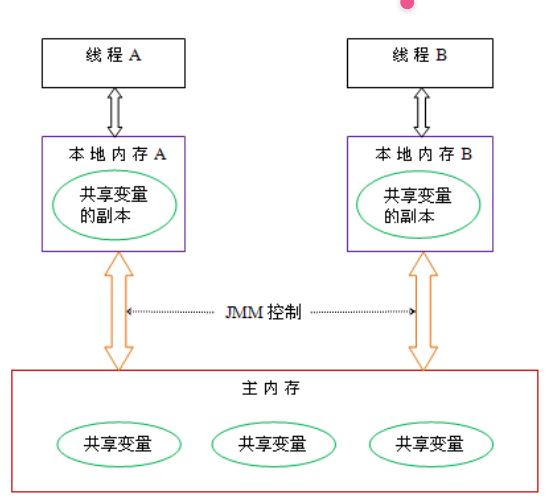
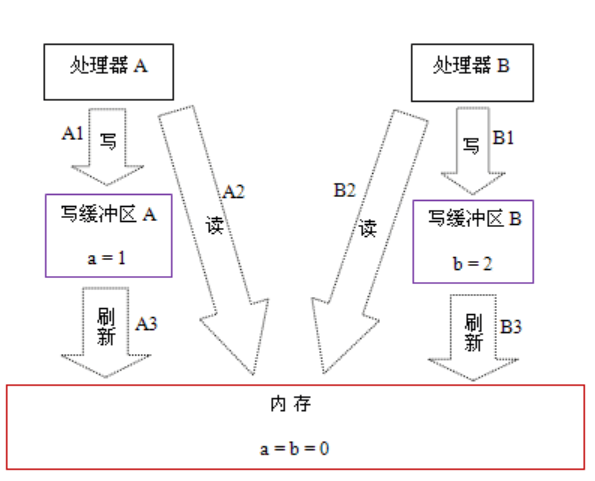
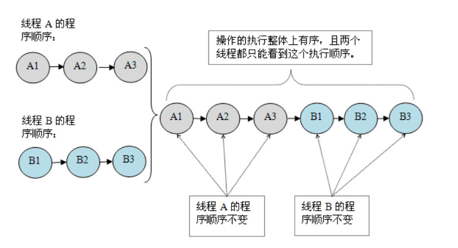
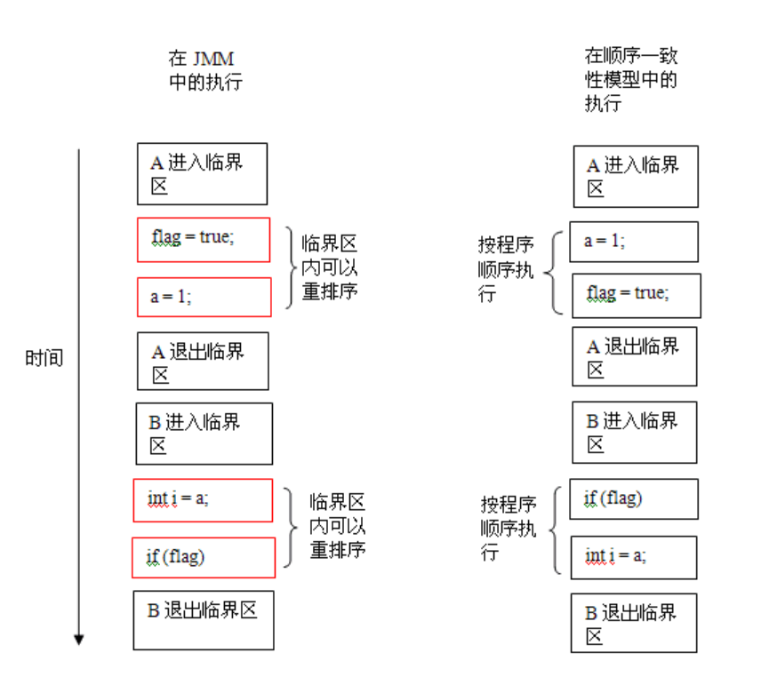
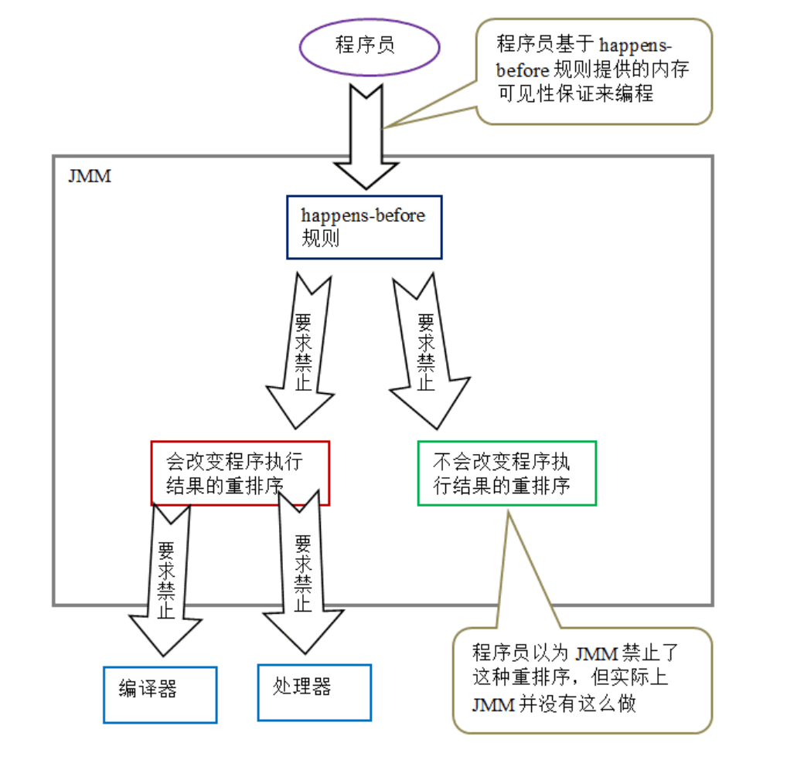

# JVM相关


# Java 内存模型详解

**Java 内存模型（Java Memory Model，简称 JMM）** 是 Java 并发编程中的一套规范/规则，它定义了：

> **在多线程环境下，一个线程对共享变量的写入，何时对另一个线程可见。**

在并发编程中，我们需要处理两个关键问题：线程之间如何通信及线程之间如何同步

* 通信

> 通信是指线程之间以何种机制来交换信息

* * 共享内存

    在共享内存的并发模型里，线程之间共享程序的公共状态，线程之间通过写 - 读内存中的公共状态来隐式进行通信。

* * 消息传递

    在消息传递的并发模型里，线程之间没有公共状态，线程之间必须通过明确的发送消息来显式进行通信。

   

* 同步

> 同步是指程序用于控制不同线程之间操作发生相对顺序的机制。

> 编程中的同步 
>
> **排队用、轮流来、别抢**

* * 在共享内存并发模型里，同步是显式进行的。程序员必须显式指定某个方法或某段代码需要在线程之间互斥执行。

* * 在消息传递的并发模型里，由于消息的发送必须在消息的接收之前，因此同步是隐式进行的。

**Java 的并发采用的是共享内存模型，J**ava 线程之间的通信总是隐式进行，整个通信过程对程序员完全透明。如果编写多线程程序的 Java 程序员不理解隐式进行的线程之间通信的工作机制，很可能会遇到各种奇怪的内存可见性问题。

```
Java 内存中共享与不共享的内容
│
├── 共享（堆内存，有可见性问题）
│   ├── 实例域（对象的成员变量）
│   ├── 静态域（类的 static 变量）
│   └── 数组元素
│
└── 不共享（栈内存，线程私有，无可见性问题）
    ├── 局部变量（方法内部定义的变量）
    ├── 方法定义参数（方法形参）
    └── 异常处理器参数（catch 块中的异常变量）
```

###  Java 内存模型（JMM)

线程之间的共享变量存储在主内存（main memory）中，每个线程都有一个私有的本地内存（local memory），本地内存中存储了该线程以读 / 写共享变量的副本。

本地内存是 JMM 的一个抽象概念，并不真实存在。它涵盖了缓存，写缓冲区，寄存器以及其他的硬件和编译器优化。

Java 内存模型的抽象示意图如下：



更具体的结构如下

```
┌─────────────────────────────────────────────────────────────────────────┐
│                    第一层：单线程正确性的底线                           │
│                      （As-If-Serial 语义）                            │
├─────────────────────────────────────────────────────────────────────────┤
│                                                                         │
│  ① 数据依赖  →  同一数据有写操作时，绝对不可重排                       │
│  ② 控制依赖  →  条件判断结果决定的操作，不能提前执行                   │
│  ③ 异常依赖  →  可能抛异常的指令，不能提前越过异常处理点               │
│                                                                         │
│  作用：保证单线程看起来“顺序执行”                                      │
└─────────────────────────────────────────────────────────────────────────┘
                                      ↓
┌─────────────────────────────────────────────────────────────────────────┐
│                    第二层：多线程可见性的抽象契约                       │
│                      （JMM 规范层）                                    │
├─────────────────────────────────────────────────────────────────────────┤
│                                                                         │
│  Happens-Before 规则：                                                  │
│  • 程序次序规则  →  单线程内，前面的操作 HB 后面的操作                  │
│  • volatile规则  →  volatile写 HB 后续对该变量的读                     │
│  • 锁规则        →  解锁 HB 后续对同一把锁的加锁                       │
│  • 传递性        →  A HB B，B HB C ⇒ A HB C                           │
│  作用：定义什么情况下可见性有保证                                       │
└─────────────────────────────────────────────────────────────────────────┘
                                      ↓
┌─────────────────────────────────────────────────────────────────────────┐
│                    第三层：JVM 实现层的执行指令                        │
│                      （内存屏障）                                      │
├─────────────────────────────────────────────────────────────────────────┤
│                                                                         │
│  JVM 将 Happens-Before 规则翻译为内存屏障，插入到指令序列中：           │
│                                                                         │
│  LoadLoad 屏障   →  前一次读完成后，才能执行后续读                      │
│  StoreStore 屏障 →  前一次写完成后，才能执行后续写                      │
│  LoadStore 屏障  →  前一次读完成后，才能执行后续写                      │
│  StoreLoad 屏障  →  前一次写完成后，才能执行后续读（最重）              │
│                                                                         │
│  作用：插入具体 CPU 指令，强制禁止或限制重排序                          │
│                                                                         │
└─────────────────────────────────────────────────────────────────────────┘
                                      ↓
┌─────────────────────────────────────────────────────────────────────────┐
│                    第四层：硬件执行层                                   │
│                      （处理器内存模型）                                 │
├─────────────────────────────────────────────────────────────────────────┤
│                                                                         │
│  x86 TSO    →  屏障指令较轻（mfence/lfence/sfence）                    │
│  ARM        →  需要更重的同步指令（dmb）                               │
│  PowerPC    →  需要重量级指令（sync）                                  │
│                                                                         │
│  作用：同一段 Java 代码，在不同 CPU 上插入的底层指令不同，但语义一致    │
│                                                                         │
└─────────────────────────────────────────────────────────────────────────┘
```

### 重排序

在执行程序时为了提高性能，编译器和处理器常常会对指令做重排序。重排序分三种类型：

- 编译器优化的重排序。编译器在不改变单线程程序语义的前提下，可以重新安排语句的执行顺序。
- 指令级并行的重排序。现代处理器采用了指令级并行技术（Instruction-Level Parallelism， ILP）来将多条指令重叠执行。如果不存在数据依赖性，处理器可以改变语句对应机器指令的执行顺序。
- 内存系统的重排序。由于处理器使用缓存和读 / 写缓冲区，这使得加载和存储操作看上去可能是在乱序执行。

上述的 1 属于编译器重排序，2 和 3 属于处理器重排序。这些重排序都可能会导致多线程程序出现内存可见性问题

### 为什么需要指令重排序？

核心原因只有三个字：**为了快**。

现代 CPU 的执行速度和内存的读取速度差距极大（差几百倍），如果不做任何优化，CPU 大部分时间都在空等数据，造成巨大的性能浪费。重排序就是为了**填满 CPU 的执行流水线，让它尽量别闲着**。

### 怎样阻止有害重排序？

```
JMM 对重排序的处理策略
│
├── 编译器重排序
│   ├── JMM 编译器重排序规则
│   ├── 禁止特定类型的编译器重排序
│   └── 不是所有重排序都禁止（只禁止会导致问题的）
│
└── 处理器重排序
    ├── JMM 处理器重排序规则
    ├── 要求 Java 编译器在生成指令序列时插入内存屏障
    ├── 通过内存屏障禁止特定类型的处理器重排序
    └── 不是所有重排序都禁止（只禁止会导致问题的）
```

#### 处理器重排序的原理

存在一个仅处理器可见的写缓冲区，写缓冲区要经过刷新才能改动内存，如果处理器先进行写操作，写入缓冲区，然后进行读操作，读到的就是未写入的数据，也就是说代码顺序是A1->A2，实际发生是A2->A1，这就是处理器重排序产生的原因



> 注意区分这里的刷新VS无效化队列里面的无效消息生效，这里是刷新是CPU自己写入的东西刷新，而无效队列里的无效消息是别的CPU发来的，一个刷新自己写的内容，一个接受别人发来的无效消息，无效消息是别人写入导致的

## 无效化队列

> **每个CPU核心都有一个无效化队列（Invalidate Queue）**，用于**暂存**收到的“缓存行失效”消息，然后**异步处理**。

| 传统方式（同步）                                | 引入无效化队列后（异步）                                     |
| :---------------------------------------------- | :----------------------------------------------------------- |
| CPU A 发失效消息给 CPU B                        | CPU A 发失效消息给 CPU B                                     |
| CPU B **立即处理**失效，标记缓存行无效，回复ACK | CPU B 将失效消息**放入队列**，**立刻回复ACK**（不等待实际处理完成） |
| CPU A 收到所有ACK后才继续执行                   | CPU A 收到ACK后立即继续执行                                  |
| **CPU B 被阻塞**，等待处理完成                  | CPU B **几乎不阻塞**，后台慢慢处理队列中的失效消息           |

**好处**：提高了CPU的执行吞吐量，不让缓存同步操作拖慢指令流水线。

**新问题**：失效消息虽然进入了队列，但还没真正应用到缓存上，所以CPU B的缓存中**还保留着旧数据**，导致读取到了过期值。

### 无效化队列 vs 写缓冲区（Store Buffer）

| 对比维度             | 写缓冲区（Store Buffer）                         | 无效化队列（Invalidate Queue）                             |
| :------------------- | :----------------------------------------------- | :--------------------------------------------------------- |
| **所属CPU**          | 每个CPU核心一个                                  | 每个CPU核心一个                                            |
| **存储内容**         | 本CPU**待写入**内存的脏数据                      | 其他CPU发来的**缓存行失效**通知                            |
| **产生原因**         | 写操作太慢，先暂存，后批量刷入内存               | 失效消息处理太慢，先暂存，后批量应用                       |
| **导致的问题**       | **写操作延迟可见**（其他CPU看不到最新值）        | **读操作读到旧值**（本CPU缓存未及时失效）                  |
| **对应的重排序类型** | 导致 **Store-Load** 重排序（写延迟导致读先执行） | 导致 **Load-Load** 重排序（读到了本该失效的旧缓存）        |
| **如何强制刷新**     | **StoreStore** 和 **StoreLoad** 屏障强制刷入内存 | **LoadLoad** 和 **StoreLoad** 屏障强制清空队列并应用到缓存 |

### 内存屏障指令

> **内存屏障**（Memory Barrier，也叫内存栅栏）是一种 CPU 指令，用来**强制处理器按照指定顺序执行内存操作**，解决 CPU 缓存和指令重排序带来的可见性、有序性问题。

### 四条屏障指令都干了什么

| 屏障指令       | **干了什么（硬件动作）**                                     | **防止什么重排序**                                           |
| :------------- | :----------------------------------------------------------- | :----------------------------------------------------------- |
| **LoadLoad**   | **处理完无效化队列**：把队列里所有"你的缓存数据过期了"的通知全部应用到缓存，确保后续读操作能看到其他CPU最新写入的数据。 | 后面的读不能跑到前面的读之前（读读不乱序）                   |
| **StoreStore** | **刷完写缓冲区**：把屏障前所有写操作从写缓冲区强制刷新到内存/缓存，确保其他CPU能看到。 | 后面的写不能跑到前面的写之前（写写不乱序）                   |
| **LoadStore**  | **读完再写**：先完成所有前面的读操作（处理无效化队列确保读到最新），然后才允许后面的写操作进入写缓冲区。 | 后面的写不能跑到前面的读之前（读写不乱序）                   |
| **StoreLoad**  | **先刷写缓冲区，再处理无效化队列**：把写缓冲区所有数据全量刷入内存 + 把无效化队列全部应用到缓存，做完这两件后，才能执行后面的读操作。 | 后面的读不能跑到前面的写之前（写读不乱序），且**同时具有上述三种屏障的全部效果** |

### 读写操作是怎样执行的

```
┌─────────────────────────────────────────────────────────────────┐
│                        完整链路                                 │
│                                                                  │
│  CPU A 执行写操作                                               │
│       ↓                                                         │
│  修改缓存行（数据变新了）                                       │
│       ↓                                                         │
│  发送"失效消息"给所有其他CPU  ←──── 写操作是"生产者"            │
│       ↓                                                         │
│  CPU B 收到失效消息                                             │
│       ↓                                                         │
│  放入无效化队列（异步处理）    ←──── 队列存储的是"别人写的通知"  │
│       ↓                                                         │
│  CPU B 执行读操作前，检查队列   ←──── 读操作是"消费者"           │
│       ↓                                                         │
│  若队列消息未应用 → 可能读到旧值（可见性问题）                   │
└─────────────────────────────────────────────────────────────────┘
```

## happens-before 

*  **happens-before 是 JMM 的核心契约：如果 A happens-before B，那么 A 的结果对 B 一定可见，且顺序不会被重排序破坏。**

* **它通过 volatile、synchronized、线程启动/终止等规则，在代码中的关键点插入内存屏障，从而阻止编译器和 CPU 的重排序。**
* 注意，两个操作之间具有 happens-before 关系，并不意味着前一个操作必须要在后一个操作之前执行！happens-before 仅仅要求前一个操作（执行的结果）对后一个操作可见，且前一个操作按顺序排在第二个操作之前（the first is visible to and ordered before the second）
*  与程序员密切相关的 happens-before 规则如下：
  - 程序顺序规则：一个线程中的每个操作，happens- before 于该线程中的任意后续操作。
  - 监视器锁规则：对一个监视器锁的解锁，happens- before 于随后对这个监视器锁的加锁。
  - volatile 变量规则：对一个 volatile 域的写，happens- before 于任意后续对这个 volatile 域的读。
  - 传递性：如果 A happens- before B，且 B happens- before C，那么 A happens- before C。

## 数据依赖性

> **数据依赖性**是指：**两条内存访问指令之间存在依赖关系，如果改变它们的执行顺序，程序的执行结果就会发生改变。**

数据依赖分下列三种类型：

| 名称   | 代码示例     | 说明                           |
| ------ | ------------ | ------------------------------ |
| 写后读 | a = 1;b = a; | 写一个变量之后，再读这个位置。 |
| 写后写 | a = 1;a = 2; | 写一个变量之后，再写这个变量。 |
| 读后写 | a = b;b = 1; | 读一个变量之后，再写这个变量。 |

上面三种情况，只要重排序两个操作的执行顺序，程序的执行结果将会被改变。

前面提到过，编译器和处理器可能会对操作做重排序。编译器和处理器在重排序时，会遵守数据依赖性，编译器和处理器不会改变存在数据依赖关系的两个操作的执行顺序。

注意，这里所说的数据依赖性仅针对单个处理器中执行的指令序列和单个线程中执行的操作，不同处理器之间和不同线程之间的数据依赖性不被编译器和处理器考虑。

## 控制依赖

* **控制依赖是指令执行与否取决于分支条件的判断结果。**
* **CPU 会通过分支预测+投机执行来绕过控制依赖，提前执行分支内的指令（猜对了就提速，猜错了就回滚）。**
* **但在多线程下，投机执行的回滚不保证缓存状态的完全恢复，所以控制依赖不能保证可见性，必须用同步机制加固。**

## as-if-serial 

（如同串行）

as-if-serial 语义的意思指：不管怎么重排序（编译器和处理器为了提高并行度），（单线程）程序的执行结果不能被改变。编译器，runtime 和处理器都必须遵守 as-if-serial 语义。

为了遵守 as-if-serial 语义，编译器和处理器不会对存在数据依赖关系的操作做重排序，因为这种重排序会改变执行结果。但是，如果操作之间不存在数据依赖关系，这些操作可能被编译器和处理器重排序。

## 单线程VS多线程

**数据依赖** 和 **as-if-serial**  **只保护单线程**，对多线程没作用，多线程要靠happens-before来守护

## 数据竞争

当程序未正确同步时，就会存在数据竞争。java 内存模型规范对数据竞争的定义如下：

- 在一个线程中写一个变量，
- 在另一个线程读同一个变量，
- 而且写和读没有通过同步来排序。

当代码中包含数据竞争时，程序的执行往往产生违反直觉的结果（前一章的示例正是如此）。如果一个多线程程序能正确同步，这个程序将是一个没有数据竞争的程序。

## 顺序一致性内存模型（理想化模型）

> **“任何执行的结果，都等同于所有处理器的操作按照某种全局顺序执行，且每个处理器自身程序中的操作顺序，都遵循其代码指定的顺序。”**

翻译成人话，就是两条铁律：

1. **程序顺序**：每个CPU核心（或线程）内部，指令的执行顺序必须和代码写的顺序一致（不能重排）。
2. **全局原子性**：所有核心之间的操作，必须能排成一个**唯一的、全局的总顺序**，而且所有核心看到的这个顺序都一样。



> **顺序一致性模型只保证“正确同步的程序”行为可预测；而对“未同步程序”，它不提供任何保证！**

- **正确同步的程序**（有锁/屏障）：SC模型保证程序执行结果和理想模型一致，你可以依赖它做逻辑判断。
- **未同步的程序**（无锁无屏障）：SC模型**只保证操作有个全局顺序**，但这个顺序完全由系统运行时动态决定（竞态），程序员无法预测，而且**结果可能毫无意义**。

## JMMvs顺序一致性内存模型执行时序对比图



**临界区**

> **临界区（Critical Section）是一段访问共享资源（如全局变量、文件）的代码，这段代码在同一时刻只允许一个线程执行。**

### 处理器内存模型

顺序一致性内存模型是一个理论参考模型，JMM 和处理器内存模型在设计时通常会把顺序一致性内存模型作为参照。JMM 和处理器内存模型在设计时会对顺序一致性模型做一些放松，因为如果完全按照顺序一致性模型来实现处理器和 JMM，那么很多的处理器和编译器优化都要被禁止，这对执行性能将会有很大的影响。

**根据对不同类型读 / 写操作组合的执行顺序的放松，可以把常见处理器的内存模型划分为下面几种类型：**

- 放松程序中写 - 读操作的顺序，由此产生了 total store ordering 内存模型（简称为 TSO）。
- 在前面 1 的基础上，继续放松程序中写 - 写操作的顺序，由此产生了 partial store order 内存模型（简称为 PSO）。
- 在前面 1 和 2 的基础上，继续放松程序中读 - 写和读 - 读操作的顺序，由此产生了 relaxed memory order 内存模型（简称为 RMO）和 PowerPC 内存模型。

注意，这里处理器对读 / 写操作的放松，是以两个操作之间不存在数据依赖性为前提的（因为处理器要遵守 as-if-serial 语义，处理器不会对存在数据依赖性的两个内存操作做重排序）。

**所有处理器内存模型都允许写 - 读重排序**

因为它们都使用了写缓存区，写缓存区可能导致写 - 读操作重排序。同时，我们可以看到这些处理器内存模型都允许更早读到当前处理器的写，原因同样是因为写缓存区：由于写缓存区仅对当前处理器可见，这个特性导致当前处理器可以比其他处理器先看到临时保存在自己的写缓存区中的写。

上面表格中的各种处理器内存模型，从上到下，模型由强变弱。**越是追求性能的处理器，内存模型设计的会越弱。**因为这些处理器希望内存模型对它们的束缚越少越好，这样它们就可以做尽可能多的优化来提高性能。

由于常见的处理器内存模型比 JMM 要弱，java 编译器在生成字节码时，会在执行指令序列的适当位置插入内存屏障来限制处理器的重排序。同时，由于各种处理器内存模型的强弱并不相同，为了在不同的处理器平台向程序员展示一个一致的内存模型，JMM 在不同的处理器中需要插入的内存屏障的数量和种类也不相同。

JMM 屏蔽了不同处理器内存模型的差异，它在不同的处理器平台之上为 java 程序员呈现了一个一致的内存模型。

### JMM 的设计

**从 JMM 设计者的角度来说，在设计 JMM 时，需要考虑两个关键因素：**

- 程序员对内存模型的使用。程序员希望内存模型易于理解，易于编程。程序员希望基于一个强内存模型来编写代码。
- 编译器和处理器对内存模型的实现。编译器和处理器希望内存模型对它们的束缚越少越好，这样它们就可以做尽可能多的优化来提高性能。编译器和处理器希望实现一个弱内存模型。

由于这两个因素互相矛盾，所以 JSR-133 专家组在设计 JMM 时的核心目标就是找到一个好的平衡点：一方面要为程序员提供足够强的内存可见性保证；另一方面，对编译器和处理器的限制要尽可能的放松。下面让我们看看 JSR-133 是如何实现这一目标的。

为了具体说明，请看前面提到过的计算圆面积的示例代码：

```java
double pi  = 3.14;    //A
double r   = 1.0;     //B
double area = pi * r * r; //C
```

上面计算圆的面积的示例代码存在三个 happens- before 关系：

- A happens- before B；
- B happens- before C；
- A happens- before C；

由于 A happens- before B，happens- before 的定义会要求：A 操作执行的结果要对 B 可见，且 A 操作的执行顺序排在 B 操作之前。 但是从程序语义的角度来说，对 A 和 B 做重排序即不会改变程序的执行结果，也还能提高程序的执行性能（允许这种重排序减少了对编译器和处理器优化的束缚）。也就是说，上面这 3 个 happens- before 关系中，虽然 2 和 3 是必需要的，但 1 是不必要的。因此，JMM 把 happens- before 要求禁止的重排序分为了下面两类：

- 会改变程序执行结果的重排序。
- 不会改变程序执行结果的重排序。

JMM 对这两种不同性质的重排序，采取了不同的策略：

- 对于会改变程序执行结果的重排序，JMM 要求编译器和处理器必须禁止这种重排序。
- 对于不会改变程序执行结果的重排序，JMM 对编译器和处理器不作要求（JMM 允许这种重排序）。

下面是 JMM 的设计示意图：



从上图可以看出两点：

- JMM 向程序员提供的 happens- before 规则能满足程序员的需求。JMM 的 happens- before 规则不但简单易懂，而且也向程序员提供了足够强的内存可见性保证（有些内存可见性保证其实并不一定真实存在，比如上面的 A happens- before B）。
- JMM 对编译器和处理器的束缚已经尽可能的少。从上面的分析我们可以看出，JMM 其实是在遵循一个基本原则：只要不改变程序的执行结果（指的是单线程程序和正确同步的多线程程序），编译器和处理器怎么优化都行。比如，如果编译器经过细致的分析后，认定一个锁只会被单个线程访问，那么这个锁可以被消除。再比如，如果编译器经过细致的分析后，认定一个 volatile 变量仅仅只会被单个线程访问，那么编译器可以把这个 volatile 变量当作一个普通变量来对待。这些优化既不会改变程序的执行结果，又能提高程序的执行效率。

### JMM 的内存可见性保证

Java 程序的内存可见性保证按程序类型可以分为下列三类：

- 单线程程序。单线程程序不会出现内存可见性问题。编译器，runtime 和处理器会共同确保单线程程序的执行结果与该程序在顺序一致性模型中的执行结果相同。
- 正确同步的多线程程序。正确同步的多线程程序的执行将具有顺序一致性（程序的执行结果与该程序在顺序一致性内存模型中的执行结果相同）。这是 JMM 关注的重点，JMM 通过限制编译器和处理器的重排序来为程序员提供内存可见性保证。
- 未同步 / 未正确同步的多线程程序。JMM 为它们提供了最小安全性保障：线程执行时读取到的值，要么是之前某个线程写入的值，要么是默认值（0，null，false）。

### JMM，处理器内存模型与顺序一致性内存模型之间的关系

JMM 是一个语言级的内存模型，处理器内存模型是硬件级的内存模型，顺序一致性内存模型是一个理论参考模型。

整体层次关系如下

```
┌─────────────────────────────────────────────────────┐
│  应用层：Java代码（synchronized、volatile、Lock）   │  ← 程序员只接触这一层
├─────────────────────────────────────────────────────┤
│  语言层：JMM（Happens-Before规则，抽象屏障）        │  ← JVM负责翻译
├─────────────────────────────────────────────────────┤
│  硬件层：处理器内存模型（x86 TSO / ARM Relaxed）    │  ← JVM适配不同CPU
└─────────────────────────────────────────────────────┘
```


