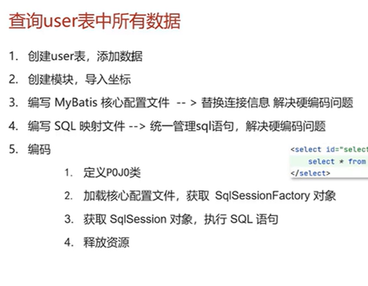
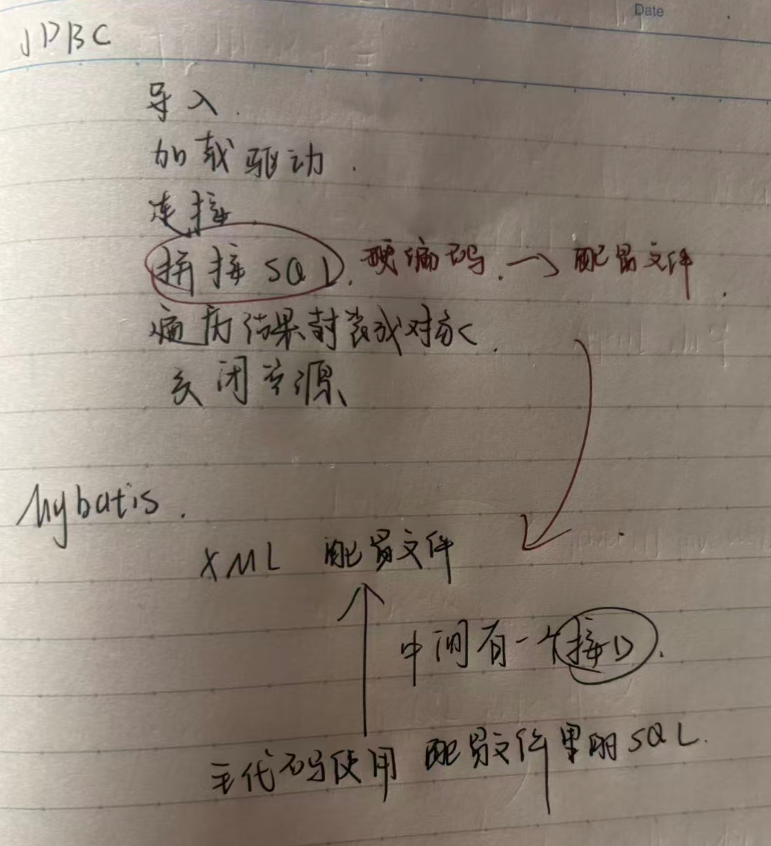
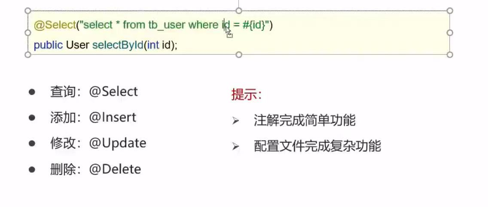
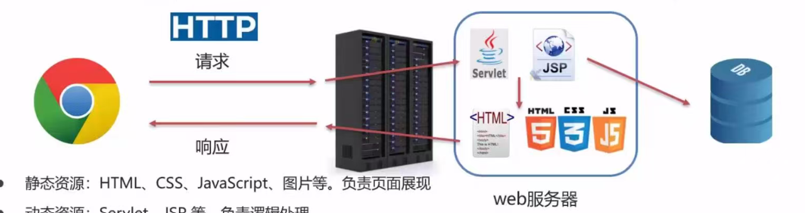

# Java web

#### 就是做网页

**JavaWeb 应用程序的三大核心组成部分及其职责：**

1. **网页（前端/展现层）**：展现数据
2. **JavaWeb程序（后端/逻辑处理层）**：作为整个应用的核心大脑，负责接收网页发来的请求，进行具体的业务逻辑运算和处理（如用户登录验证、数据计算等），并将处理结果返回给网页。
3. **数据库（数据存储层）**：负责持久化地存储和管理应用中的所有数据，为 JavaWeb 程序提供数据的增删改查（CRUD）服务。

# MySQL

#### 常用SQL语句

### 1. 查询（DQL）—— 重中之重

```sql
-- 基础查询
SELECT * FROM 表名;
SELECT 列1, 列2 FROM 表名;
-- 去除重复记录
SELECT DISTINCT 字段名 FROM 用户表


-- 条件查询
SELECT * FROM 用户表 WHERE 年龄 > 18;

-- 模糊查询
SELECT * FROM 用户表 WHERE 姓名 LIKE '%张%';

-- 排序
SELECT * FROM 用户表 ORDER BY 年龄 DESC;   -- 降序
-- ASC 升序（默认排序）
-- 分组查询
SELECT 性别, COUNT(*) FROM 用户表 GROUP BY 性别;

-- 分页查询
SELECT * FROM 表名 LIMIT 起始索引, 每页条数;

-- 多表联查（最常用）
SELECT u.姓名, o.订单金额 
FROM 用户表 u 
JOIN 订单表 o ON u.id = o.用户id;
```

### 2. 新增（DML）

```sql
INSERT INTO 用户表 (姓名, 年龄) VALUES ('张三', 25);
```

### 3. 修改（DML）

```sql
UPDATE 用户表 SET 年龄 = 26 WHERE 姓名 = '张三';
```

### 4. 删除（DML）

```sql
DELETE FROM 用户表 WHERE 姓名 = '张三';
```

### 5. 建表（DDL）

```sql
CREATE TABLE 用户表 (
    id INT PRIMARY KEY AUTO_INCREMENT,   -- 主键自增
    姓名 VARCHAR(50),
    年龄 INT,
    创建时间 DATETIME
);
```

==注意==MySQL是先写字段名再写数据类型，和Java是反着来的


DOUBLE(总长度，小数点后保留的位数)

## 聚合函数

| 函数            | 作用                       | 返回值类型   |
| :-------------- | :------------------------- | :----------- |
| **COUNT(\*)**   | 统计总行数（所有记录数）   | 数字（整数） |
| **COUNT(列名)** | 统计该列 **非空** 值的数量 | 数字（整数） |
| **SUM(列名)**   | 计算该列数值的总和         | 数字         |
| **AVG(列名)**   | 计算该列数值的平均值       | 数字         |
| **MAX(列名)**   | 找出该列的最大值           | 与列类型一致 |
| **MIN(列名)**   | 找出该列的最小值           | 与列类型一致 |

##  **约束的概念**

- 约束是作用于表中列上的规则，用于限制加入表的数据
- 约束的存在保证了数据库中数据的正确性、有效性和完整性

## 约束类型

| 约束类型       | 关键字        | 作用                                             | 示例                                                     |
| :------------- | :------------ | :----------------------------------------------- | :------------------------------------------------------- |
| **主键约束**   | `PRIMARY KEY` | 唯一标识表中的每一行，**非空且唯一**             | `id INT PRIMARY KEY`                                     |
| **唯一约束**   | `UNIQUE`      | 该列的值 **不能重复**，但可以为 NULL             | `手机号 VARCHAR(11) UNIQUE`                              |
| **非空约束**   | `NOT NULL`    | 该列 **不能为空**（必须有值）                    | `姓名 VARCHAR(20) NOT NULL`                              |
| **默认值约束** | `DEFAULT`     | 如果插入时没指定值，则自动填入默认值             | `状态 INT DEFAULT 0`                                     |
| **外键约束**   | `FOREIGN KEY` | 表与表之间的关联，保证 **引用完整性**            | `用户id INT, FOREIGN KEY (用户id) REFERENCES 用户表(id)` |
| **检查约束**   | `CHECK`       | 限制列的值必须满足某个条件（MySQL 支持但不强制） | `年龄 INT CHECK (年龄 >= 18)`                            |

外键约束例子

```mysql
-- 创建学生表（父表）
CREATE TABLE students (
    id INT PRIMARY KEY AUTO_INCREMENT,
    name VARCHAR(50) NOT NULL,
    class VARCHAR(20)
);

-- 创建成绩表（子表），添加外键
CREATE TABLE scores (
    id INT PRIMARY KEY AUTO_INCREMENT,
    student_id INT,
    subject VARCHAR(30),
    score INT,
    -- 外键约束：student_id 引用 students 表的 id
    CONSTRAINT fk_student FOREIGN KEY (student_id) REFERENCES students(id)
    -- CONSTRAINT 名称 FOREIGN KEY (本表字段) REFERENCES 父表(字段) 
    -- [ON DELETE 动作] [ON UPDATE 动作]
    ON DELETE CASCADE   -- 父表删除时，子表级联删除
    ON UPDATE CASCADE   -- 父表更新时，子表级联更新
);
```

| **不写** ON DELETE / ON UPDATE | **阻止删除/更新**（默认是 RESTRICT） |
| ------------------------------ | ------------------------------------ |
| **写了** ON DELETE CASCADE     | 允许级联删除                         |
| **写了** ON UPDATE CASCADE     | 允许级联更新                         |


##### 数据库设计

* 有哪些表
* 表里有哪些字段
* 表和表之间有什么关系

### 表关系

一对多：从表建立外键关联主表

多对多：建立第三张中间表，中间表至少包含两个外键，分别关联两方主键

一对一：常见于表拆分，将一个实体中经常使用的字段放一张表，不经常使用的字段放另一张表，用于提升查询性能，在任意一方加入外键，另一方关联主键，并且设置外键为唯一（UNIQUE)

# 多表查询

* ## 连接查询

  * 内连接：相当于查询A B交集数据

    ### 内连接查询语法

    ```mysql
    -- 隐式内连接
    SELECT 字段列表 FROM 表1, 表2... WHERE 条件;
    
    -- 显示内连接
    SELECT 字段列表 FROM 表1 [INNER] JOIN 表2 ON 条件;
    ```

  * 外连接

    * 左外连接：查询A表和交集部分数据
    * 右外连接

    #### 外连接查询语法

    ```mysql
    -- 左外连接
    SELECT 字段列表 FROM 表1 LEFT [OUTER] JOIN 表2 ON 条件;
    
    -- 右外连接
    SELECT 字段列表 FROM 表1 RIGHT [OUTER] JOIN 表2 ON 条件;
    ```

* ## 子查询

  嵌套查询

  1. 子查询根据查询结果不同，作用不同：

     - 单行单列：作为条件值，使用 = != < 等进行比较判断

     ```mysql
     SELECT 字段列表 FROM 表 WHERE 字段名 = (子查询);
     ```

     

     - 多行单列：作为条件值，使用 in 等关键字进行条件判断

     ```mysql
     SELECT 字段列表 FROM 表 WHERE 字段名 in (子查询);
     ```

     

     - 多行多列：作为虚拟表

     ```mysql
     SELECT 字段列表 FROM (子查询) WHERE 条件;
     ```

  ##### 例子

  ```mysql
  -- 查询工资高于猪八戒的员工信息
  select * from emp;
  
  -- 1. 查询猪八戒的工资
  select salary from emp where name = '猪八戒';
  
  -- 2. 查询工资高于猪八戒的员工信息
  select * from emp where salary > 3600;
  
  select * from emp where salary > (select salary from emp where name = '猪八戒');
  ```

  

# 事务

**事务是一组SQL操作的逻辑单元，要么全部成功，要么全部失败**

```mysql
-- 开始事务
START TRANSACTION;
-- 或
BEGIN;

-- 执行SQL操作
UPDATE account SET money = money - 100 WHERE name = '张三';
UPDATE account SET money = money + 100 WHERE name = '李四';

-- 提交事务（确认操作）
COMMIT;

-- 或回滚事务（撤销操作）
ROLLBACK;
```

## 四大特征总览(ACID)

| 特征       | 英文        | 含义                                             | 一句话记忆             |
| :--------- | :---------- | :----------------------------------------------- | :--------------------- |
| **原子性** | Atomicity   | 事务是一个不可分割的整体，要么全成功，要么全失败 | 一荣俱荣，一损俱损     |
| **一致性** | Consistency | 事务前后，数据状态保持逻辑一致                   | 数据不能乱，规则不能破 |
| **隔离性** | Isolation   | 多个事务互不干扰，并发执行如同串行               | 你干你的，我干我的     |
| **持久性** | Durability  | 事务提交后，数据永久保存，即使宕机也不丢失       | 一旦提交，永不磨灭     |

# JDBC（Java数据库连接）

## 用Java语言操作关系型数据库的一套API

通过JDBC让同一套Java代码操作不同的关系型数据库

接口就是规则


## JDBC 快速入门

### 步骤

1. 创建工程，导入驱动jar包

   - mysql-connector-java-5.1.48.jar

2. 注册驱动

   ```mysql
   Class.forName("com.mysql.jdbc.Driver");
   ```

3. 获取连接

   ```mysql
   Connection conn = DriverManager.getConnection(url, username, password);
   ```

4. 定义SQL语句

   ```mysql
   String sql = "update...";
   ```

5. 获取执行SQL对象

   ```mysql
   Statement stmt = conn.createStatement();
   ```

6. 执行SQL

   ```mysql
   stmt.executeUpdate(sql);
   ```

7. 处理返回结果

8. 释放资源

# API详解

- **DriverManager**：**驱动管理类**（或驱动管理器）
- **Connection**：**数据库连接对象**（或连接接口）
- **Statement**：**执行SQL语句对象**（或语句执行器）
- **ResultSet**：**结果集对象**（或查询结果集）
- **PreparedStatement**：**预编译SQL执行对象**（或预编译语句对象）

# DriverManager

* 注册驱动
* 管理数据库连接

```mysql
// 建立连接的核心方法
DriverManager.getConnection(String url, String user, String password);
```

URL写法

jdbc:mysql://ip地址(域名):端口号/数据库名称?参数键值对1&参数键值对2...

# Connection

* 获取执行SQL的对象
* 管理事务

#### 获取执行 SQL 的对象

- **普通执行SQL对象**

Statement createStatement()

* ##### 预编译SQL的执行SQL对象：防止SQL注入

PreparedStatement prepareStatement(sql)

- ##### 执行存储过程的对象

CallableStatement prepareCall(sql)

#### 事务管理

- ##### MySQL 事务管理

  - 开启事务：BEGIN; / START TRANSACTION;
  - 提交事务：COMMIT;
  - 回滚事务：ROLLBACK;

MySQL默认自动提交事务

- ##### JDBC 事务管理：

  Connection接口中定义了3个对应的方法

  开启事务：setAutoCommit(boolean autoCommit): true为自动提交事务；false为手动提交事务，即为开启事务
  提交事务：commit()
  回滚事务：rollback()

# Statement

- Statement作用：
  1. 执行SQL语句

##### int executeUpdate(sql): 执行DML、DDL语句

返回值：(1) DML语句影响的行数 (2) DDL语句执行后，执行成功也可能返回 0

##### ResultSet executeQuery(sql): 执行DQL语句

返回值：ResultSet 结果集对象

# ResultSet(结果集对象)

- **ResultSet(结果集对象)作用**:
  1. 封装了DQL查询语句的结果  
  
     ```
     `ResultSet stmt.executeQuery(sql):` 执行DQL语句，返回ResultSet对象  
     ```
  
- **获取查询结果**

```
boolean next(): 
(1) 将光标从当前位置向前移动一行  
(2) 判断当前行是否为有效行  

- **返回值**:  
  - true: 有效行，当前行有数据  
  - false: 无效行，当前行没有数据  

---
```

```
xxx getXxx(参数): 获取数据  

- xxx: 数据类型; 如: int getInt(参数); String getString(参数)  
- **参数**:  
  - int: 列的编号，从1开始  
  - String: 列的名称
```

#### 使用步骤：

1. 游标向下移动一行，并判断该行是否有数据：next()
2. 获取数据：getXxx(参数)

```java
//循环判断游标是否是最后一行末尾
while(rs.next()){
//获取数据
rs.getXxx(参数);
}
```

# **PreparedStatement**

##### 预防sql注入问题

**PreparedStatement**预防SQL 注入的原理：将敏感字符进行转义

## SQL注入

**SQL注入**是一种通过**将恶意SQL代码拼接到正常SQL语句中**，从而破坏SQL语句原有结构，达到绕过验证、窃取数据或破坏数据库的攻击方式。

### 经典案例

假设登录验证的SQL语句为：

```
SELECT * FROM users WHERE username = '输入的用户名' AND password = '输入的密码';
```

如果攻击者输入：

- **用户名**：`admin' --`
- **密码**：随便输

拼接后的SQL变成：

```
SELECT * FROM users WHERE username = 'admin' -- ' AND password = '随便';
```

> `--` 是SQL中的注释符，后面的条件全被注释掉，**无需密码即可登录**。

如果输入：

- **用户名**：`admin' OR '1'='1`

拼接后：

```
SELECT * FROM users WHERE username = 'admin' OR '1'='1' AND password = '...';
```

> `OR '1'='1'` 永远为真，**直接绕过认证**。

#### 使用 PreparedStatement防御

```java
String sql = "SELECT * FROM users WHERE username = ? AND password = ?";
PreparedStatement pstmt = conn.prepareStatement(sql);
pstmt.setString(1, userInput);
pstmt.setString(2, passInput);
ResultSet rs = pstmt.executeQuery();
```

> `?` 占位符传入的值会**自动转义**，不参与SQL结构解析，从根本上杜绝注入。


# 数据库连接池


#### 连接池 = 一个存放数据库连接的缓存容器（集合）+ 一套管理这些连接生命周期的逻辑

##### 连接池的实现

- **标准接口**: DataSource
  - 官方(SUN)提供的数据库连接池标准接口，由第三方组织实现此接口。
  - 功能: 获取连接

# Driud使用步骤（数据库连接池

1. 导入jar包 druid-1.1.12.jar  
2. 定义配置文件  
3. 加载配置文件  
4. 获取数据库连接池对象  
5. 获取连接

# Maven

- 提供了一套标准化的项目结构  
- 提供了一套标准化的构建流程（编译、测试、打包、发布……）  
- 提供了一套依赖管理机制

### maven仓库

* 本地仓库：计算机目录
* 中央仓库：全球唯一
* 远程仓库（私服）：公司自己维护的仓库

### Maven坐标

**什么是坐标？**

- Maven 中的坐标是资源的唯一标识
- 使用坐标来定义项目或引入项目中需要的依赖

**Maven 坐标主要组成**

- `groupId`：定义当前Maven项目隶属组织名称（通常是域名反写，例如：com.itheima）
- `artifactId`：定义当前Maven项目名称（通常是模块名称，例如 order-service、goods-service）
- `version`：定义当前项目版本号

# Mybatis

##### 一款持久层框架，用于简化JDBC开发

JavaEE三层架构：

* 表现层：也称为 **Web 层** 或 **用户界面层**，是直接与用户交互的层次。
* 业务层：也称为 **Service 层** 或 **应用层**，是系统的核心，负责处理具体的业务逻辑
* 持久层：也称为 **DAO 层（Data Access Object）** 或 **数据访问层**，负责与数据库进行交互。

硬编码问题：就是字符串，连接地址什么的写进代码里

解决方式：把这些东西都写到配置文件里，用到的时候读取配置文件

```
📦 MyBatis 使用方法
│
├── 1️⃣ 引入依赖
│   ├── Maven 项目 → pom.xml 添加
│   │   ├── mybatis 核心包
│   │   └── 数据库驱动（如 mysql-connector-java）
│   └── Spring Boot 项目 → 用 mybatis-spring-boot-starter
│
├── 2️⃣ 配置 MyBatis
│   ├── 方式一：XML 配置文件（原生 MyBatis）
│   │   ├── mybatis-config.xml
│   │   │   ├── environments（环境配置）
│   │   │   │   ├── transactionManager（事务管理）
│   │   │   │   └── dataSource（数据源：驱动、URL、账号密码）
│   │   │   └── mappers（注册 Mapper XML 路径）
│   │   └── 适用：非 Spring 项目
│   │
│   └── 方式二：Spring Boot 配置文件（推荐）
│       ├── application.yml 或 application.properties
│       │   ├── spring.datasource（数据源配置）
│       │   └── mybatis（专属配置）
│       │       ├── mapper-locations（XML 文件位置）
│       │       ├── type-aliases-package（实体类包路径）
│       │       └── configuration.map-underscore-to-camel-case（下划线转驼峰）
│       └── 适用：Spring Boot 项目
│
├── 3️⃣ 创建实体类（对应数据库表）
│   ├── 类名 = 表名（驼峰命名，如 User → user 表）
│   ├── 属性 = 字段（如 id, name, age）
│   ├── 必须有无参构造方法
│   ├── 必须有 getter / setter
│   └── 可选：toString() 方便调试
│
├── 4️⃣ 写 Mapper 接口（声明方法）
│   ├── 位置：com.xxx.mapper 包下
│   ├── 内容：只定义方法签名
│   │   ├── 方法名 = XML 里的 id
│   │   ├── 参数：用 @Param 注解命名（多参数时必须）
│   │   └── 返回值：实体类 或 List<实体类>
│   └── 特点：只有声明，没有实现（MyBatis 自动生成代理）
│
├── 5️⃣ 写 Mapper XML（写 SQL）

├── 6️⃣ 使用 MyBatis（调用）
│   ├── 方式一：原生 MyBatis（无 Spring）
│   │   ├── 加载配置文件（Resources.getResourceAsStream）
│   │   ├── 构建 SqlSessionFactory（SqlSessionFactoryBuilder）
│   │   ├── 打开 SqlSession（factory.openSession）
│   │   ├── 获取 Mapper（session.getMapper）
│   │   ├── 调用方法
│   │   └── 提交事务（session.commit）→ 增删改必须
│   │
│   └── 方式二：Spring Boot 整合（推荐）
│       ├── Service 层 @Autowired 注入 Mapper
│       ├── 直接调用 Mapper 方法
│       ├── 事务管理：@Transactional 注解
│       └── Controller 层调用 Service
│
└── ⚠️ 常见坑（排错指南）
    ├── Invalid bound statement → namespace 或 id 不匹配
    ├── 查询结果全 null → 字段名和属性名不一致（开驼峰或用 resultMap）
    ├── 插入后 ID 为 null → 忘记配置 useGeneratedKeys / keyProperty
    ├── 找不到 XML → mapper-locations 路径不对
    └── 中文乱码 → 连接 URL 加字符集参数
```


案例



### Mapper代理开发

Mapper代理开发是MyBatis提供的一种**接口式编程**方式。你**只需要编写一个Mapper接口**，MyBatis会自动为你生成这个接口的实现类（动态代理对象），你无需编写传统的`xxxMapper.xml`对应的`DaoImpl`实现类。

# 使用Mybatis和纯JDBC区别

#### 纯 JDBC 

```java
public List<User> findUsersByAge(int minAge, int maxAge) {
    List<User> users = new ArrayList<>();
    Connection conn = null;
    PreparedStatement pstmt = null;
    ResultSet rs = null;
    try {
        // 1. 手动加载驱动、获取连接
        Class.forName("com.mysql.cj.jdbc.Driver");
        conn = DriverManager.getConnection(
            "jdbc:mysql://localhost:3306/test", "root", "123456");

        // 2. 拼接动态 SQL（注意：这里用占位符无法处理动态字段，只能用字符串拼接）
        String sql = "SELECT id, name, age FROM user WHERE age >= ? AND age <= ?";
        pstmt = conn.prepareStatement(sql);
        pstmt.setInt(1, minAge);
        pstmt.setInt(2, maxAge);
        rs = pstmt.executeQuery();

        // 3. 手动遍历 ResultSet，封装成对象
        while (rs.next()) {
            User user = new User();
            user.setId(rs.getInt("id"));
            user.setName(rs.getString("name"));
            user.setAge(rs.getInt("age"));
            users.add(user);
        }
    } catch (Exception e) {
        e.printStackTrace();
    } finally {
        // 4. 手动关闭资源（必须按顺序）
        try { if (rs != null) rs.close(); } catch (SQLException e) { e.printStackTrace(); }
        try { if (pstmt != null) pstmt.close(); } catch (SQLException e) { e.printStackTrace(); }
        try { if (conn != null) conn.close(); } catch (SQLException e) { e.printStackTrace(); }
    }
    return users;
}
```

#### 使用Mybatis

**Mapper 接口（Java）：**

```java
    public interface UserMapper {
        // 直接用 XML 或注解写动态 SQL
        List<User> findUsersByAge(@Param("minAge") int minAge, 
                                  @Param("maxAge") int maxAge);

        @Options(useGeneratedKeys = true, keyProperty = "id")  // 一行注解搞定返回 ID
        int insertUser(User user);
    }
```

>  XML 是什么？
>
> **XML** 是一种**标记语言**（类似 HTML），在 MyBatis 里它专门用来**集中存放 SQL 语句**。也就是.xml文件
>
> ##### 注解是什么？
>
> **注解**就是**直接写在 Java 方法上的标签**，用 `@` 开头，把 SQL 和 Java 代码放在一起。


**Mapper XML（动态 SQL）：**

```java
<select id="findUsersByAge" resultType="User">
    SELECT id, name, age FROM user
    <where>
        <if test="minAge != null and minAge > 0">
            AND age >= #{minAge}
        </if>
        <if test="maxAge != null and maxAge > 0">
            AND age <= #{maxAge}
        </if>
    </where>
</select>

<insert id="insertUser" useGeneratedKeys="true" keyProperty="id">
    INSERT INTO user(name, age) VALUES(#{name}, #{age})
</insert>
```

**业务层调用：**

```java
@Autowired
private UserMapper userMapper;

public void demo() {
    // 1. 查询 - 动态条件自动生成 SQL，无需手动拼接
    List<User> users = userMapper.findUsersByAge(18, 30);
    
    // 2. 插入 - 执行后 user 对象自动获得自增 ID
    User newUser = new User("张三", 25);
    userMapper.insertUser(newUser);
    System.out.println("新ID: " + newUser.getId());  // 直接获取
}
```



#### 如果用Mybatis的话不一样的操作要写不同的接口吗，比如查询和添加?

**一张表对应一个 Mapper 接口,对应一个.xml文件，各种操作都写成方法**

### 动态SQL

**动态SQL = 根据传入参数的不同，在运行时动态拼接出不同的SQL语句。**

### 注解

注解是写在接口代码里的，写注解就不用写配置文件了



# HTML（超文本标记语言）

**HTML是一种语言，和Java一样，所有的网页都是用HTML写出来的，**

**超文本：超越了文本的限制，比普通文本更强大，除了文字信息，还可以定义图片，音频，视频等内容**

**标记语言：由标签构成的语言**

**HTML运行在浏览器上，，HTML标签由浏览器进行解析**

**HTML标签都是预定义好的**

**W3C标准：网页主要由三部分组成**

**结构：HTML**

**表现：CSS**（层叠样式表）

CSS也是一门语言

**行为：JavaScript**

# Web核心

## B/S架构



- **B/S 架构**：Browser/Server，浏览器/服务器 架构模式，它的特点是，客户端只需要浏览器，应用程序的逻辑和数据都存储在服务器端。浏览器只需要请求服务器，获取Web资源，服务器把Web资源发送给浏览器即可
  - 好处：易于维护升级：服务器端升级后，客户端无需任何部署就可以使用到新的版本

* **静态资源**：HTML、CSS、JavaScript、图片等。负责页面展现

- **动态资源**：Servlet、JSP等。负责逻辑处理
- **数据库**：负责存储数据

- **HTTP协议**：定义通信规则
- **Web服务器**：负责解析HTTP协议，解析请求数据，并发送响应数据