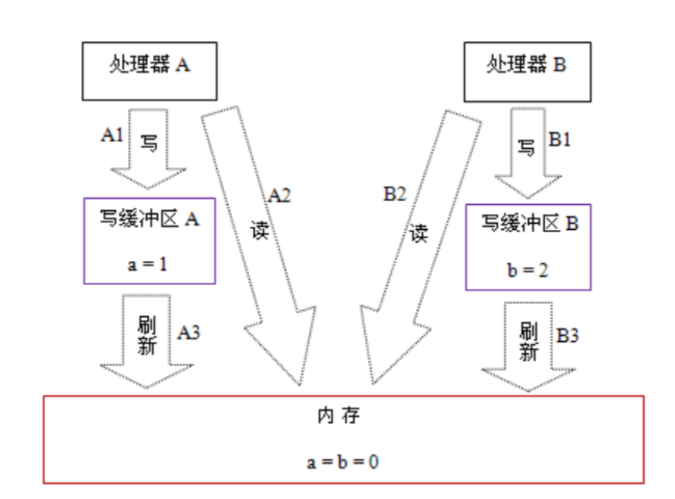
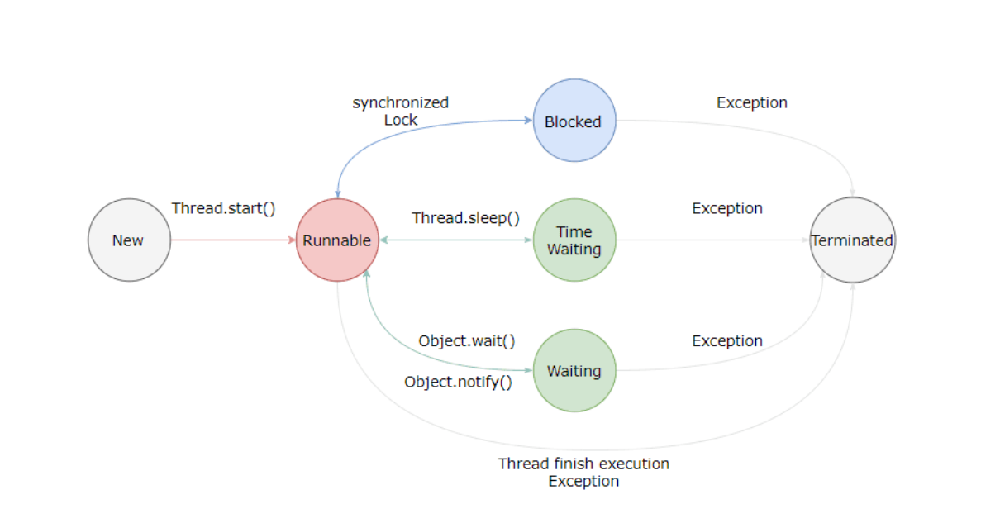
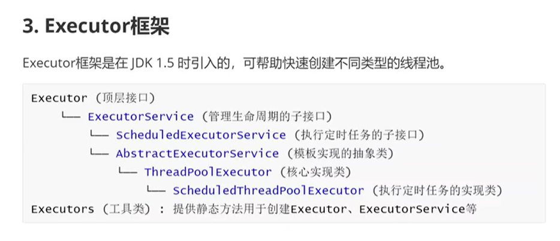

# Java并发

## 为什么需要多线程

众所周知，CPU、内存、I/O 设备的速度是有极大差异的，为了合理利用 CPU 的高性能，平衡这三者的速度差异，计算机体系结构、操作系统、编译程序都做出了贡献，主要体现为:

- CPU 增加了缓存，以均衡与内存的速度差异；// 导致 `可见性`问题
- 操作系统增加了进程、线程，以分时复用 CPU，进而均衡 CPU 与 I/O 设备的速度差异；// 导致 `原子性`问题
- 编译程序优化指令执行次序，使得缓存能够得到更加合理地利用。// 导致 `有序性`问题

| 种类                      | 作用                  | 速度                 | 断电后数据 |
| :------------------------ | :-------------------- | :------------------- | :--------- |
| **CPU**                   | 执行指令、做运算      | 极快（1倍基准）      | 丢失       |
| **内存（RAM）**           | 临时存储运行中数据    | 中等（约慢100倍）    | 丢失       |
| **I/O 设备（硬盘/网络）** | 持久化存储 / 传输数据 | 极慢（约慢1000万倍） | 保留       |

## 线程不安全

**当多个线程同时访问同一个共享数据，且至少有一个线程执行写操作，由于没有采取同步措施，导致数据出现错误、不一致或程序行为异常时，这个类、对象或代码就是线程不安全的。**

## 并发三要素

* ### 原子性

  > **一个或多个操作，要么全部执行且不被中断，要么全部不执行。**

**分时复用（线程切换）导致的问题**

* ### 可见性

  > 一个线程对共享变量的修改，其他线程能否立刻看到。

**CPU缓存引起的问题**

* ### 有序性

  > **程序执行的顺序是否按照代码的先后顺序执行。**

**编译器和 CPU 为了优化性能，可能会重排序指令引起的问题**

在执行程序时为了提高性能，编译器和处理器常常会对指令做重排序。重排序分三种类型：

- 编译器优化的重排序。编译器在不改变单线程程序语义的前提下，可以重新安排语句的执行顺序。
- 指令级并行的重排序。现代处理器采用了指令级并行技术（Instruction-Level Parallelism，ILP）来将多条指令重叠执行。如果不存在数据依赖性，处理器可以改变语句对应机器指令的执行顺序。
- 内存系统的重排序。由于处理器使用缓存和读/写缓冲区，这使得加载和存储操作看上去可能是在乱序执行。

从 Java 源代码到最终实际执行的指令序列，会分别经历下面三种重排序：

源代码 → 1编译器优化重排序 → 2指令级并行重排序 → 3内存系统重排序 → 最终执行的指令序列

## JAVA是怎么解决并发问题的: JMM(Java内存模型)

### **JMM**核心

Java 内存模型规范了 JVM 如何提供按需禁用缓存和编译优化的方法。

具体来说，这些方法包括：

- volatile、synchronized 和 final 三个关键字
- Happens-Before 规则

### **另一个角度，JMM是如何保证可见性，有序性，原子性的？**

* #### **可见性**

  > 一个线程对共享变量的修改，其他线程能否立刻看到。

  *   **为什么会产生可见性问题？**

    * **CPU缓存不一致**

      * 现代CPU是多核的，每个核心都有自己的缓存，当写操作写入缓存但还没来得及刷新到内存时，如果执行读操作就会发生可见性问题，结构情况如下

        

      

    * **指令重排序**

      为了提升执行效率，**编译器**和**CPU**都可能对指令进行重排序。

      **重排序指令规则**

      **核心规则：单线程执行结果必须保持不变。**（As-If-Serial 语义）

      具体约束规则：

      * 数据依赖
      * 控制依赖
      * 异常依赖

    * **编译器优化**

      编译器优化的核心：**在保证单线程逻辑不变的前提下，通过变换代码，让程序跑得更快、资源占用更少。**

      **1. 剔除“无用功”**

      - **死代码消除**：删掉永远不会执行的代码（如 `if(false)` 块）。
      - **冗余加载消除**：避免反复从内存读同一个变量，直接复用上次读到的值（这会导致多线程看不见新修改）。

      **2. 算“提前算好的”**

      - **常量折叠**：编译时直接算出结果（如 `2*3*4` 直接变成 `24`），运行时不用再算。
      - **循环不变量外提**：把循环内每次都不变的结果提到循环外，只算一次。

      **3. 减少“重复劳动”**

      - **公共子表达式消除**：相同的计算只算一次，到处复用。
      - **内联展开**：把小方法的调用“复制”到调用处，省去方法调用的开销（栈帧、跳转）。

      **4. 摊平“循环开销”**

      - **循环展开**：把循环体复制几份，减少 `i++`、条件判断和跳转指令的次数。

      **5. 调整“执行顺序”**

      - **指令重排序**：把耗时长的非依赖指令提前执行，用来“填满”CPU的流水线空隙（这是导致多线程可见性问题的主因）。

    但并不是所有编译器优化都会导致可见性问题

* #### **有序性**

  > **有序性是指：在多线程环境下，一个线程观察另一个线程的操作执行顺序时，看到的顺序是否和代码编写的顺序一致。**

  **主要由重排序导致**

  ```
  你写的代码（源代码顺序）
          ↓
     ① 编译器重排序  ← 第一个可能打乱顺序的地方
          ↓
     ② JIT编译器重排序 ← 第二个可能打乱顺序的地方
          ↓
     ③ 处理器重排序  ← 第三个可能打乱顺序的地方
          ↓
  实际被其他线程看到的顺序
  ```

* **原子性**

  > **原子性是指：一个或多个操作，要么全部执行成功，要么全部不执行，不会在执行过程中被其他线程打断，处于“执行到一半”的状态。**

* **导致原子性问题的原因**

  * **CPU时间片轮转**

    操作系统用**时间片轮转**来调度线程。一个线程获得CPU时间片后开始执行，时间片用完就被切出去，换另一个线程执行。

  * **64位读写分两次**

    Java 规范允许 `long` 和 `double` 的读写**不保证原子性**，可能会分成两次 32 位操作。

    ```java
    // 初始值
    long x = 0x00000000FFFFFFFFL;
    
    // 线程A：写入 long 值
    x = 0xFFFF000000000000L;   // 分两次写入：先写高32位，再写低32位
    
    // 线程B：读取 long 值
    long y = x;                // 如果读的时候A刚写完高32位，低32位还没写
                               // y 可能是 0xFFFF0000FFFFFFFFL（脏数据）❌
    ```

  * **复合操作非原子**

    很多看起来是一行的操作，实际底层是多步：

    | 代码                       | 底层步骤                         | 是否原子                             |
    | :------------------------- | :------------------------------- | :----------------------------------- |
    | `i++`                      | 读→加→写                         | ❌ 否                                 |
    | `i--`                      | 读→减→写                         | ❌ 否                                 |
    | `i += n`                   | 读→加→写                         | ❌ 否                                 |
    | `obj.field = new Object()` | 分配内存→初始化→赋值（可能重排） | ❌ 否（赋值本身是原子的，但整体不是） |
    | `a = b`                    | 读 b→写 a                        | ❌ 否                                 |

  # 关键字

  # ==三个关键字==

  # Happens-Before 

  **详细规则层级结构图**

  ```
  Happens-Before 规则（7条）
  │
  ├── 基础规则（单线程保障）
  │   └── ① 程序次序规则
  │       └── 单线程内，前面的操作 HB 后面的操作
  │
  ├── 核心规则（跨线程可见性）
  │   ├── ② volatile变量规则
  │   │   └── volatile写 HB 后续读
  │   └── ③ 锁规则
  │       └── 解锁 HB 后续加锁
  │
  ├── 连接规则（串联所有规则）
  │   └── ④ 传递性规则
  │       └── A HB B，B HB C ⇒ A HB C
  │
  └── 生命周期规则（线程状态流转）
      ├── ⑤ 线程启动规则
      │   └── start() HB 线程内所有操作
      ├── ⑥ 线程终止规则
      │   └── 线程所有操作 HB join()返回
      └── ⑦ 线程中断规则
          └── interrupt() HB 检测到中断
  ```

## 对象的安全程度分类

```java
Java对象线程安全程度（从高到低）
│
├── ① 不可变对象
│
├── ② 绝对线程安全对象
│   // 不管运行时环境如何，调用者都不需要任何额外的同步措施。
├── ③ 相对线程安全对象
│    // 相对线程安全需要保证对这个对象单独的操作是线程安全的，在调用的时候不需要做额外的保障措施。但是对于一些特定顺序的连续调用，就可能需要在调用端使用额外的同步手段来保证调用的正确性。
├── ④ 线程兼容
│
└── ⑤ 线程对立
```

## 线程安全的实现方式

（大体结构如下）

```
线程安全的实现方法
│
├── ① 互斥同步（阻塞同步）
│   ├── 核心思路：悲观并发策略
│   │   └── 只要不加锁，就认为一定会出问题
│   │
│   ├── 实现方式
│   │   ├── synchronized
│   │   └── ReentrantLock
│   │
│   └── 缺点
│       └── 线程阻塞和唤醒带来的性能问题
│
├── ② 非阻塞同步
│   ├── 核心思路：乐观并发策略
│   │   └── 先执行操作，有冲突再重试
│   │
│   ├── 实现基础：硬件原子操作
│   │   └── CAS（Compare-And-Swap）
│   │       ├── 操作数：内存地址V，旧预期值A，新值B
│   │       └── 规则：V的值等于A时才更新为B
│   │
│   ├── Java实现：AtomicInteger
│   │   └── 内部使用Unsafe类的CAS操作
│   │       └── 冲突时循环重试（自旋）
│   │
│   └── ABA问题
│       ├── 问题描述：A→B→A，CAS误认为没变过
│       └── 解决方案：AtomicStampedReference（带版本号）
│
└── ③ 无同步方案
    ├── 核心思路：不涉及共享数据，自然无需同步
    │
    ├── 栈封闭
    │   └── 局部变量在虚拟机栈中，线程私有
    │
    ├── 线程本地存储（ThreadLocal）
    │   ├── 原理：每个线程维护自己的变量副本
    │   │   └── Thread类中有ThreadLocalMap成员
    │   │       └── 存储 ThreadLocal → value 键值对
    │   │
    │   └── 注意点：使用完手动调用remove()
    │       └── 避免内存泄漏（尤其在线程池场景）
    │
    └── 可重入代码（纯代码）
        └── 特征：不依赖堆数据/公共资源，状态由参数传入
```

# 并发--线程基础知识

### 线程状态转换

### 


#### 新建(New)

创建后尚未启动。

#### [#](#可运行-runnable) 可运行(Runnable)

可能正在运行，也可能正在等待 CPU 时间片。

包含了操作系统线程状态中的 Running 和 Ready。

#### [#](#阻塞-blocking) 阻塞(Blocking)

等待获取一个排它锁，如果其线程释放了锁就会结束此状态。

#### [#](#无限期等待-waiting) 无限期等待(Waiting)

等待其它线程显式地唤醒，否则不会被分配 CPU 时间片。

| 进入方法                                   | 退出方法                             |
| ------------------------------------------ | ------------------------------------ |
| 没有设置 Timeout 参数的 Object.wait() 方法 | Object.notify() / Object.notifyAll() |
| 没有设置 Timeout 参数的 Thread.join() 方法 | 被调用的线程执行完毕                 |
| LockSupport.park() 方法                    | -                                    |

#### [#](#限期等待-timed-waiting) 限期等待(Timed Waiting)

无需等待其它线程显式地唤醒，在一定时间之后会被系统自动唤醒。

调用 Thread.sleep() 方法使线程进入限期等待状态时，常常用“使一个线程睡眠”进行描述。

调用 Object.wait() 方法使线程进入限期等待或者无限期等待时，常常用“挂起一个线程”进行描述。

睡眠和挂起是用来描述行为，而阻塞和等待用来描述状态。

阻塞和等待的区别在于，阻塞是被动的，它是在等待获取一个排它锁。而等待是主动的，通过调用 Thread.sleep() 和 Object.wait() 等方法进入。

| 进入方法                                 | 退出方法                                        |
| ---------------------------------------- | ----------------------------------------------- |
| Thread.sleep() 方法                      | 时间结束                                        |
| 设置了 Timeout 参数的 Object.wait() 方法 | 时间结束 / Object.notify() / Object.notifyAll() |
| 设置了 Timeout 参数的 Thread.join() 方法 | 时间结束 / 被调用的线程执行完毕                 |
| LockSupport.parkNanos() 方法             | -                                               |
| LockSupport.parkUntil() 方法             | -                                               |

### [#](#死亡-terminated) 死亡(Terminated)

可以是线程结束任务之后自己结束，或者产生了异常而结束

## 线程使用方式

有三种使用线程的方法:

- 实现 Runnable 接口；
- 实现 Callable 接口；
- 继承 Thread 类。

实现 Runnable 和 Callable 接口的类只能当做一个可以在线程中运行的任务，不是真正意义上的线程，因此最后还需要通过 Thread 来调用。可以说任务是通过线程驱动从而执行的。

## Executor框架

### 

### Executor（基础接口）

**定义**：只有一个方法的顶层接口。

```java
public interface Executor {
    void execute(Runnable command);
}
```

### ExecutorService（增强接口）

**定义**：继承 `Executor`，增加了生命周期管理和异步结果获取能力。

```java
public interface ExecutorService extends Executor {
    // 生命周期管理
    void shutdown();                    // 温柔关闭（等待已有任务完成）
    List<Runnable> shutdownNow();       // 立即关闭（中断正在执行的任务）
    boolean isShutdown();               // 是否已关闭
    boolean isTerminated();             // 是否所有任务已完成
    boolean awaitTermination(long timeout, TimeUnit unit) throws InterruptedException;

    // 异步结果获取
    <T> Future<T> submit(Callable<T> task);      // 提交有返回值的任务
    <T> Future<T> submit(Runnable task, T result);
    Future<?> submit(Runnable task);

    // 批量执行
    <T> List<Future<T>> invokeAll(Collection<? extends Callable<T>> tasks) throws InterruptedException;
    <T> T invokeAny(Collection<? extends Callable<T>> tasks) throws InterruptedException, ExecutionException;
}
```

## Submit方法3. submit()方法

ExecutorService 接口定义了 submit()方法的3个重载。

```java
// 1. 提交Callable任务
<T> Future<T> submit(Callable<T> task);

// 2. 提交Runnable任务
Future<?> submit(Runnable task);

// 3. 提交Runnable任务并预设返回值
<T> Future<T> submit(Runnable task, T result);
```


## ThreadPoolExecutor 创建线程池

ThreadPoolExecutor是具体实现类，ExecutorService是接口

ThreadPoolExecutor的构造方法

```java
new ThreadPoolExecutor(
    int corePoolSize,    // 核心线程数（全职客服，核心线程数>=0）
    int maxPoolSize,    // 最大线程数（全职客服+临时客服，最大线程数>=1）
    long keepAliveTime,    // 非核心线程空闲存活时间（临时客服的解约条件）
    TimeUnit unit,    // 时间单位（例如TimeUnit.SECONDS）
    BlockingQueue<Runnable> workQueue,    // 任务队列（坐席忙，请等待）
    ThreadFactory threadFactory,    // 线程工厂
    RejectedExecutionHandler handler    // 拒绝策略（坐席全忙，请稍后再投）
);
```

## 自定义线程工厂

```java
/**
 * 自定义线程工厂
 */
public class MyThreadFactory implements ThreadFactory {
    @Override
    public Thread newThread(Runnable r) {
        Thread thread = new Thread(r);
        // 设置守护线程
        thread.setDaemon(true);
        // 设置线程名字
        thread.setName("线程_" + thread.getId());
        return thread;
    }
}
```

## 拒绝策略的激发条件

```
                    触发拒绝策略
                          ▲
                          │
              ┌───────────┴───────────┐
              │                       │
         线程数达到               队列已满
     maximumPoolSize            (workQueue)
              │                       │
              └───────────┬───────────┘
                          │
                   两个条件缺一不可
```

## Future 接口 

`Future` = 一张“取货凭证”，代表一个异步任务的执行状态和结果。拿着它，你可以查进度、拿结果、取消任务。

接口定义：

```java
public interface Future<V> {
    // 取消任务
    boolean cancel(boolean mayInterruptIfRunning);
    
    // 是否已取消
    boolean isCancelled();
    
    // 是否已完成（正常完成/异常/取消都算完成）
    boolean isDone();
    
    // 阻塞等待，获取结果
    V get() throws InterruptedException, ExecutionException;
    
    // 阻塞等待，超时则抛出 TimeoutException
    V get(long timeout, TimeUnit unit)
        throws InterruptedException, ExecutionException, TimeoutException;
}
```

### future接口的get（）方法

```java
// 版本1：无限等待，任务被取消引发CancellationException
V get() throws InterruptedException, ExecutionException;

// 版本2：限时等待，超时会引发TimeoutException
V get(long timeout, TimeUnit unit) throws InterruptedException,
    ExecutionException, TimeoutException;
```

