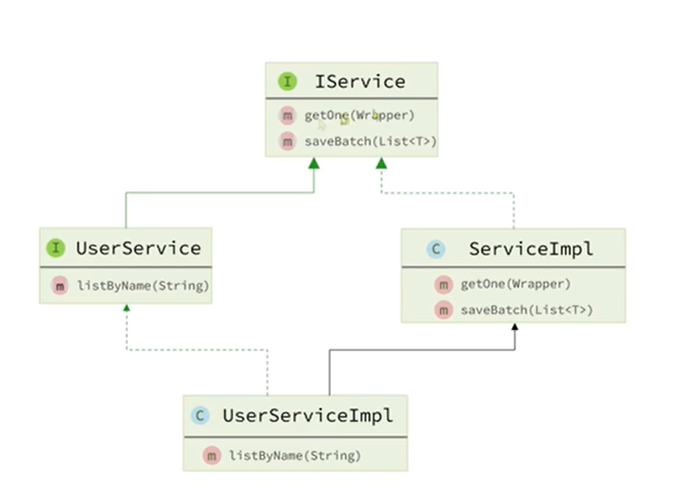

# **MyBatis-Plus**

==什么是反射==

- 变量名驼峰转下划线作为表名
- 名为id的字段作为主键
- 变量名驼峰转下划线作为表的字段名

**@TableName 指定表名**

**@TableId 标记主键**

**@TableField 映射普通字段**

# Wrapper条件构造器

##### Wrapper类继承体系


| Wrapper 类型              | 用途         | 字段引用方式                            | 类型安全 |
| :------------------------ | :----------- | :-------------------------------------- | :------- |
| **`QueryWrapper`**        | 构建查询条件 | 字符串（字段名）                        | 否       |
| **`LambdaQueryWrapper`**  | 构建查询条件 | **Lambda 表达式**（`Entity::getField`） | **是**   |
| **`UpdateWrapper`**       | 构建更新条件 | 字符串（字段名）                        | 否       |
| **`LambdaUpdateWrapper`** | 构建更新条件 | **Lambda 表达式**（`Entity::getField`） | **是**   |

##### Lambda就是在原来的方法基础上把硬编码的部分转换成函数

#### 查询 (`LambdaQueryWrapper`)

这是最常用的场景。下面演示如何构建一个“查询名字中包含'张'，且年龄大于等于20岁，并按年龄降序排列”的条件。

```java
// 创建 LambdaQueryWrapper 对象
LambdaQueryWrapper<User> wrapper = new LambdaQueryWrapper<>();

// 构造查询条件
wrapper.like(User::getUsername, "张")   // username LIKE '%张%'
       .ge(User::getAge, 20)            // age >= 20
       .orderByDesc(User::getAge);      // ORDER BY age DESC

// 执行查询，userMapper 是 MyBatis-Plus 自动生成的 Mapper 对象
List<User> userList = userMapper.selectList(wrapper);
```

# wrapper常用方法

## 一、比较条件（核心）

| 方法             | 说明                    | 示例（Lambda）                                               |
| :--------------- | :---------------------- | :----------------------------------------------------------- |
| **`eq`**         | 等于 =                  | `.eq(User::getAge, 18)` → `age = 18`                         |
| **`ne`**         | 不等于 <>               | `.ne(User::getAge, 18)` → `age <> 18`                        |
| **`gt`**         | 大于 >                  | `.gt(User::getAge, 18)` → `age > 18`                         |
| **`ge`**         | 大于等于 >=             | `.ge(User::getAge, 18)` → `age >= 18`                        |
| **`lt`**         | 小于 <                  | `.lt(User::getAge, 18)` → `age < 18`                         |
| **`le`**         | 小于等于 <=             | `.le(User::getAge, 18)` → `age <= 18`                        |
| **`between`**    | BETWEEN 值1 AND 值2     | `.between(User::getAge, 18, 30)` → `age BETWEEN 18 AND 30`   |
| **`notBetween`** | NOT BETWEEN 值1 AND 值2 | `.notBetween(User::getAge, 18, 30)` → `age NOT BETWEEN 18 AND 30` |
| **`in`**         | 字段 IN (值集合)        | `.in(User::getId, Arrays.asList(1,2,3))` → `id IN (1,2,3)`   |
| **`notIn`**      | 字段 NOT IN (值集合)    | `.notIn(User::getId, Arrays.asList(1,2,3))` → `id NOT IN (1,2,3)` |
| **`isNull`**     | 字段 IS NULL            | `.isNull(User::getEmail)` → `email IS NULL`                  |
| **`isNotNull`**  | 字段 IS NOT NULL        | `.isNotNull(User::getEmail)` → `email IS NOT NULL`           |

------

## 二、模糊查询

| 方法            | 说明              | 示例                                                         |
| :-------------- | :---------------- | :----------------------------------------------------------- |
| **`like`**      | 全模糊匹配 `%值%` | `.like(User::getUsername, "张")` → `username LIKE '%张%'`    |
| **`notLike`**   | 全模糊不匹配      | `.notLike(User::getUsername, "张")`                          |
| **`likeLeft`**  | 左模糊 `%值`      | `.likeLeft(User::getUsername, "张")` → `username LIKE '%张'` |
| **`likeRight`** | 右模糊 `值%`      | `.likeRight(User::getUsername, "张")` → `username LIKE '张%'` |

------

## 三、排序

| 方法              | 说明                      | 示例                                                    |
| :---------------- | :------------------------ | :------------------------------------------------------ |
| **`orderByAsc`**  | 升序                      | `.orderByAsc(User::getAge)` → `ORDER BY age ASC`        |
| **`orderByDesc`** | 降序                      | `.orderByDesc(User::getAge)` → `ORDER BY age DESC`      |
| **`orderBy`**     | 自定义排序（可指定升/降） | `.orderBy(true, true, User::getId)` → `ORDER BY id ASC` |

------

## 四、逻辑组合（AND / OR）

| 方法             | 说明          | 示例                                                         |
| :--------------- | :------------ | :----------------------------------------------------------- |
| **`and`**        | 嵌套 AND 条件 | `.eq("name","a").and(i -> i.eq("age",18).or().eq("age",20))` → `name='a' AND (age=18 OR age=20)` |
| **`or`**         | 嵌套 OR 条件  | `.eq("name","a").or(i -> i.eq("age",18).eq("gender","男"))` → `name='a' OR (age=18 AND gender='男')` |
| **`or`**（无参） | 直接拼接 OR   | `.eq("name","a").or().eq("name","b")` → `name='a' OR name='b'` |

------

## 五、指定查询字段（仅查询）

| 方法         | 说明           | 示例                                                         |
| :----------- | :------------- | :----------------------------------------------------------- |
| **`select`** | 指定返回的字段 | `.select(User::getId, User::getUsername, User::getAge)` → 只查这三列 |

------

## 六、更新专用（仅 UpdateWrapper）

| 方法         | 说明                             | 示例                                                         |
| :----------- | :------------------------------- | :----------------------------------------------------------- |
| **`set`**    | 设置更新字段的值                 | `.set(User::getBalance, 1000)` → `SET balance = 1000`        |
| **`setSql`** | 直接写 SQL 片段（用于自增/函数） | `.setSql("balance = balance + 100")` → `SET balance = balance + 100` |

------

## 七、聚合函数与分组（高级）

| 方法          | 说明                         | 示例                                                   |
| :------------ | :--------------------------- | :----------------------------------------------------- |
| **`groupBy`** | 分组                         | `.groupBy(User::getAge)` → `GROUP BY age`              |
| **`having`**  | 分组后的筛选（配合 groupBy） | `.groupBy(User::getAge).having("sum(balance) > 1000")` |
| **`func`**    | 灵活调用函数（支持 IF 判断） | `.func(i -> { if (条件) { i.eq(...); } })`             |

------

## 八、动态条件（最常用技巧）

很多 Wrapper 方法都支持 **`condition`** 参数，只有 condition 为 `true` 时才会拼接该条件：

```java
// 前端传入的参数可能为 null
String name = request.getName();
Integer minAge = request.getMinAge();

LambdaQueryWrapper<User> wrapper = new LambdaQueryWrapper<>();
wrapper.like(StringUtils.hasText(name), User::getUsername, name)   // name不为空才拼接
       .ge(minAge != null, User::getAge, minAge);                  // minAge不为空才拼接
```

这样写可以避免大量的 `if` 判断，代码更简洁。

# 自定义SQL

##### 为什么需要自定义SQL

Wrapper擅长处理where条件但无法处理字段运算、多表、函数等复杂逻辑

## 写法

**Wrapper 负责拼装 WHERE 条件，你自己负责写 UPDATE/SELECT 的"主干"部分**。

| 分工       | 谁负责           | 示例                                                         |
| :--------- | :--------------- | :----------------------------------------------------------- |
| WHERE 条件 | Wrapper 自动生成 | `WHERE id IN (1,2,4)`                                        |
| SQL 主干   | 你手写在 XML 中  | `UPDATE tb_user SET balance = balance - 200`                 |
| 最终 SQL   | 两者拼接         | `UPDATE tb_user SET balance = balance - 200 WHERE id IN (1,2,4)` |

图中的 `${ew.customSqlSegment}` 会被 MyBatis-Plus 自动替换成 Wrapper 生成的 WHERE 子句。

## 示例

 **基于 Wrapper 构建 where 条件**

```
List<Long> ids = List.of(1L, 2L, 4L);
int amount = 200;
// 1. 构建条件
LambdaQueryWrapper<User> wrapper = new LambdaQueryWrapper<>(User::getId, ids);
// 2. 自定义SQL方法调用
userMapper.updateBalanceByIds(wrapper, amount);
```

------

**② 在 mapper 方法参数中用 @Param 注解声明 wrapper 变量名称，必须是 ew**

```
void updateBalanceByIds(@Param("ew") LambdaQueryWrapper<User> wrapper, @Param("amount") int amount);
```

------

**③ 自定义 SQL，并使用 Wrapper 条件**

```xml
<update id="updateBalanceByIds">
    UPDATE tb_user SET balance = balance - #{amount} ${ew.customSqlSegment}
</update>
```

## Service 接口 vs Service 实现类

在 Spring 项目中，Service 层通常分为两部分：

| 组成部分           | 文件名                 | 作用                             |
| :----------------- | :--------------------- | :------------------------------- |
| **Service 接口**   | `UserService.java`     | **声明**有哪些业务方法（菜单）   |
| **Service 实现类** | `UserServiceImpl.java` | **实现**这些业务方法（后厨做菜） |



### **Mapper 接口**和**Service 接口**

| 接口类型         | 它"接"的是谁和谁                    |
| :--------------- | :---------------------------------- |
| **Mapper 接口**  | **接 Service 和数据库**             |
| **Service 接口** | **接 Controller 和 Service 实现类** |

# 概念区分乱炖

**Service 层**

* service接口：连接**Controller 和 Service 实现类**
* service实现类

**mapper接口**：连接**Service 和数据库**

**wrapper类**：写service层代码的时候需要用到where条件的时候用wrapper化简

wrapper长成这样:

```java
wrapper.like(User::getUsername, "张")   // username LIKE '%张%'
       .ge(User::getAge, 20)            // age >= 20
       .orderByDesc(User::getAge);      // ORDER BY age DESC
```


