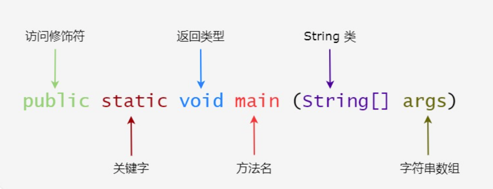

# java基础

##### 面向对象：

* 把世界看成由一个个对象组成，只需要调度各个对象，对象自己知道该干什么

##### 面向过程：

* 先干什么，再干什么，在过程中涉及哪些对象就调用哪些对象
   **最后问一句：** 你现在脑海里，是把“登录功能”想成“一个验证账号密码的流程（过程）”，还是想成“用户对象执行了一个登录的动作（对象）”？

Java面向对象的三大特性包括：**封装、继承、多态**：

- **封装**：封装是指将对象的属性（数据）和行为（方法）结合在一起，对外隐藏对象的内部细节，仅通过对象提供的接口与外界交互。封装的目的是增强安全性和简化编程，使得对象更加独立。
- **继承**：继承是一种可以使得子类自动共享父类数据结构和方法的机制。它是代码复用的重要手段，通过继承可以建立类与类之间的层次关系，使得结构更加清晰。
- **多态**：多态是指允许不同类的对象对同一消息作出响应。即同一个接口，使用不同的实例而执行不同操作。多态性可以分为编译时多态（重载）和运行时多态（重写）。它使得程序具有良好的灵活性和扩展性。

# 多态体现在哪几个方面？

多态在面向对象编程中可以体现在以下几个方面：

## 方法重载：

- 方法重载是指同一类中可以有多个同名方法，它们具有不同的参数列表（参数类型、数量或顺序不同）。虽然方法名相同，但根据传入的参数不同，编译器会在编译时确定调用哪个方法。
- 示例：对于一个 `add` 方法，可以定义为 `add(int a, int b)` 和 `add(double a, double b)`。

## 方法重写：

- 方法重写是指子类能够提供对父类中同名方法的具体实现。在运行时，JVM会根据对象的实际类型确定调用哪个版本的方法。这是实现多态的主要方式。
- 示例：在一个动物类中，定义一个 `sound` 方法，子类 `Dog` 可以重写该方法以实现 `bark`，而 `Cat` 可以实现 `meow`。

## 接口与实现：

- 多态也体现在接口的使用上，多个类可以实现同一个接口，并且用接口类型的引用来调用这些类的方法。这使得程序在面对不同具体实现时保持一贯的调用方式。
- 示例：多个类（如 `Dog`、`Cat`）都实现了一个 `Animal` 接口，当用 `Animal` 类型的引用调用 `makeSound` 方法时，会触发对应的实现。

**接口（Interface）** 是 Java 中一种**引用类型**，它定义了一组**方法签名**，但不提供实现（Java 8+ 可以有默认方法和静态方法）。

## 向上转型和向下转型：

- 在Java中，可以使用**父类类型的引用指向子类对象**，这是向上转型。通过这种方式，可以在运行时采用不同的子类实现。
- 向下转型是将父类引用转回其子类类型，但在执行前需要确认引用实际指向的对象类型以避免ClassCastException

# 抽象类和普通类区别？

- 实例化：普通类可以直接实例化对象，而抽象类不能被实例化，只能被继承。
- 方法实现：普通类中的方法可以有具体的实现，而抽象类中的方法可以有实现也可以没有实现。
- 继承：普通类和抽象类在继承规则上完全一样——都只能被单继承（extends），都可以实现多个接口（implements），这一点两者没有区别。
- 实现限制：普通类可以被其他类继承和使用，而抽象类一般用于作为基类，被其他类继承和扩展使用。

**单继承** 指的是：**一个类只能直接继承一个父类**。


##### 分布式

**好处：**

1. **性能不够（扛不住）**：双11来了，一台服务器CPU烧到100%也处理不完请求。分布式允许你**水平扩展**——加机器！10台不够，加100台，大家平摊流量（这叫**负载均衡**）。
2. **害怕宕机（容错性）**：单机一旦断电或硬盘坏了，整个系统瘫痪，这叫**单点故障**。分布式里，前台部有3个员工（3台机器），即使有1个请假（宕机），另外2个还能继续干活，系统依然可用（这叫**高可用**）。
3. **距离太远（延迟）**：你的用户遍布全球，服务器全在北京，美国用户访问会很慢。分布式允许你在**美国也部署一套**（就近访问），这叫**异地多活**。
    **CAP定理**（帽子定理）

- **C（一致性，Consistency）**：所有人看到的账本数据都是一样的。你在A柜台存了100块，去B柜台查余额，立刻能查到100块。
- **A（可用性，Availability）**：系统必须随时响应。只要你去查，柜台必须给你回复（哪怕数据不是最新）。
- **P（分区容错性，Partition Tolerance）**：网络断了（比如A机房和B机房的光缆被挖断了），系统依然能工作。

**现实是：网络故障（P）是必然发生的。** 所以，你只能在 **CP** 和 **AP** 之间二选一：

- **选CP（银行转账）**：宁可让你暂时查不到余额（不可用），也绝不给你算错钱（强一致）。

* **选AP（刷短视频）**：必须先让你能刷出来（可用），哪怕刚关注的UP主新视频，你这刷新了两次才出来（最终一致）。

==C语言指针vsJava引用==



**源文件要和public类名保持一致**

public类名是对外开放的接口，一个文件只有一个，通过映射使该文件能被快速找到

**标识符**就是名字，类名、变量名以及方法名都被称为标识符

**修饰符**修饰类中方法和属性。主要有两类修饰符：

- 访问控制修饰符 : default, public , protected, private
- 非访问控制修饰符 : final, abstract, static, synchronized

#### Java 关键字

下面列出了 Java 关键字。这些保留字不能用于常量、变量、和任何标识符的名称。

| 类别                 | 关键字                         | 说明                 |
| :------------------- | :----------------------------- | :------------------- |
| 访问控制             | private                        | 私有的               |
| protected            | 受保护的                       |                      |
| public               | 公共的                         |                      |
| default              | 默认                           |                      |
| 类、方法和变量修饰符 | abstract                       | 声明抽象             |
| class                | 类                             |                      |
| extends              | 扩充、继承                     |                      |
| final                | 最终值、不可改变的             |                      |
| implements           | 实现（接口）                   |                      |
| interface            | 接口                           |                      |
| native               | 本地、原生方法（非 Java 实现） |                      |
| new                  | 创建                           |                      |
| static               | 静态                           |                      |
| strictfp             | 严格浮点、精准浮点             |                      |
| synchronized         | 线程、同步                     |                      |
| transient            | 短暂                           |                      |
| volatile             | 易失                           |                      |
| 程序控制语句         | break                          | 跳出循环             |
| case                 | 定义一个值以供 switch 选择     |                      |
| continue             | 继续                           |                      |
| do                   | 运行                           |                      |
| else                 | 否则                           |                      |
| for                  | 循环                           |                      |
| if                   | 如果                           |                      |
| instanceof           | 实例                           |                      |
| return               | 返回                           |                      |
| switch               | 根据值选择执行                 |                      |
| while                | 循环                           |                      |
| 错误处理             | assert                         | 断言表达式是否为真   |
| catch                | 捕捉异常                       |                      |
| finally              | 有没有异常都执行               |                      |
| throw                | 抛出一个异常对象               |                      |
| throws               | 声明一个异常可能被抛出         |                      |
| try                  | 捕获异常                       |                      |
| 包相关               | import                         | 引入                 |
| package              | 包                             |                      |
| 基本类型             | boolean                        | 布尔型               |
| byte                 | 字节型                         |                      |
| char                 | 字符型                         |                      |
| double               | 双精度浮点                     |                      |
| float                | 单精度浮点                     |                      |
| int                  | 整型                           |                      |
| long                 | 长整型                         |                      |
| short                | 短整型                         |                      |
| 变量引用             | super                          | 父类、超类           |
| this                 | 本类                           |                      |
| void                 | 无返回值                       |                      |
| 保留关键字           | goto                           | 是关键字，但不能使用 |
| const                | 是关键字，但不能使用           |                      |

**注意：**Java 的 null 不是关键字，类似于 true 和 false，它是一个字面常量，不允许作为标识符使用。

**方法的重载和重写**

**重载（Overload）：同一个类里，方法名相同，参数列表不同（编译时多态）。**

**重写（Override）：子类里，方法名和参数列表完全相同，覆盖父类的方法（运行时多态）。**

**对象是类的实例，类是对象的模板**

**重写**

| **① 方法名必须相同**           | 改了名字就不是重写了       | 父类 `speak()` → 子类 `speak2()` ❌        |
| ------------------------------ | -------------------------- | ----------------------------------------- |
| **② 参数列表必须相同**         | 参数不同就是重载，不是重写 | 父类 `speak()` → 子类 `speak(String s)` ❌ |
| **③ 返回值必须相同**（或协变） | 可以用子类返回类型         | 父类 `Object` → 子类 `String` ✅           |

**重写记得加@Override，用于标志即将重写父类的方法，开启安全检测**

### 关于 `@Override` 的常见误区

| 误区                              | 真相                                                         |
| :-------------------------------- | :----------------------------------------------------------- |
| **加了 `@Override` 才能实现重写** | **错！** 重写是Java语法的特性，**不写注解也能重写**。`@Override` 只是**安全检测**，不是必要条件。 |
| **只能用在继承父类时**            | **错！** 实现**接口**中的抽象方法时，也可以加 `@Override`（Java 6 起支持）。 |
| **构造方法可以加 `@Override`**    | **错！** 构造方法不能被重写，加了会报编译错误。              |

**import**

导入包和类，这样要用到某个类时就只需要写类名，不需要写全路径

**数据类型**

**变量类型**

**修饰符**

## Java方法

方法包含于类或对象中

* **实例方法**就是属于“对象”的方法。必须通过 `new` 创建对象后，用 `对象名.方法名()` 来调用。它可以直接访问该对象的实例属性（成员变量）。

* **类方法**（Class Method）就是用 `static` 关键字修饰的方法，它属于类本身，不属于任何对象，可以直接通过类名调用。

  **同义词：** 类方法 = 静态方法（Static Method）。

* #### 类方法（静态）—— 适合“不依赖对象状态”的场景

  如果你的方法**不需要读取或修改任何对象特有的数据**，那就应该设计成静态的。

  ####  普通方法（实例）—— 适合“操作对象状态”的场景

  如果你的方法**需要操作或依赖某个对象独有的数据**，就必须是实例方法。

* **构造方法**

  每次生成新对象，new的时候用到的方法，可以用于对象的初始化

  比如，对于鸟这一类，我想要所有新new出来的鸟的羽毛都是红色的

  ```java
  public class Bird{
      
      public Bird (){
          this.featherColor = "红色";
      }
      
      private String featherColor;    // 羽毛颜色
      private String species;         // 物种（麻雀、鹦鹉、老鹰...）
      private int age;               // 年龄（月）
      private double weight;         // 体重（千克）
      private boolean canFly;        // 是否会飞
      private String name;           // 鸟儿名字（宠物鸟特有）
      
  }
  ```

| 规则                                  | 说明                                                       |
| :------------------------------------ | :--------------------------------------------------------- |
| **① 名字必须和类名完全相同**          | 类叫 `ArrayBinaryTree`，构造方法就必须叫 `ArrayBinaryTree` |
| **② 不能写返回值类型**                | `void`、`int`、`String` 统统不能写                         |
| **③ 由 `new` 自动调用，不能手动调用** | `new ArrayBinaryTree(10)` 自动执行，不能 `对象.构造方法()` |

**无参构造方法**（默认/空构造）用来创建对象时**使用默认值**；**有参构造方法**用来创建对象时**直接赋予指定值**。它们的核心区别在于**“创建对象时，是否允许你传入初始数据”**。

###  一个极其重要的默认规则（面试高频）

> **如果你在类中编写了任何一个有参构造方法，那么系统就不会再为你自动生成那个默认的无参构造方法了。**

- **默认情况**：如果你没写任何构造方法，编译器会自动帮你生成一个**无参空构造**（里面啥都不做）。
- **一旦你写了有参构造**，编译器就认为“你肯定想自己控制对象的创建”，所以不再赠送无参构造。

**后果**：很多框架（如 Spring、MyBatis）底层依赖无参构造来通过反射创建对象。如果你只写了有参构造，没写无参构造，在框架中直接`new`或自动注入时，就会报类似 `NoSuchMethodException` 的错误。

**正确做法**：一旦你写了有参构造，**建议显式地也写一个无参构造**（即使里面什么都不写）。

**有参构造和无参构造实例**

```java
public class Student {
    private String name;
    private int age;

    // 无参构造方法
    public Student() {
        // 没有传入任何参数，就赋默认值
        this.name = "未知";
        this.age = 0;
        System.out.println("调用了无参构造");
    }

    // 有参构造方法（带两个参数）
    public Student(String name, int age) {
        this.name = name;
        this.age = age;
        System.out.println("调用了有参构造");
    }

    public void printInfo() {
        System.out.println("姓名：" + name + "，年龄：" + age);
    }
}
```


| 场景                         | 用哪个           | 原因                                                         |
| :--------------------------- | :--------------- | :----------------------------------------------------------- |
| **不确定初始值**，想先占个坑 | **无参构造**     | 比如后面要通过`setName()`慢慢赋值，或者用反射框架（如Spring）创建对象，它们通常先调无参构造，再通过反射注入属性。 |
| **一创建就必须有完整信息**   | **有参构造**     | 比如银行账户，`new Account("123456", 1000)`，必须同时传入账号和初始余额，否则对象不完整。有参构造可以**保证对象创建即合法**，避免空指针异常。 |
| **支持多种创建方式**         | **同时保留两者** | 通过**构造方法重载**（Overload），提供多个有参构造（比如只传名字，或只传年龄），灵活适应不同需求。 |

**三个方法实例**

```java
public class Student {
    // 成员变量
    private String name;
    private static int count = 0;   // 统计总人数（所有对象共享）
    
    // ===== ① 构造方法 =====
    // 作用：new 对象时自动调用，初始化对象
    public Student(String name) {
        this.name = name;
        count++;
        System.out.println("创建了：" + name + "，总人数：" + count);
    }
    
    // ===== ② 实例方法 =====
    // 作用：属于对象，操作对象自己的数据（不加 static）
    public void sayHello() {
        System.out.println("我是 " + name);  // 能访问实例变量
    }
    
    // ===== ③ 类方法（静态方法） =====
    // 作用：属于类，不依赖对象，做工具功能（加 static）
    public static void showCount() {
        System.out.println("总人数：" + count);  // 只能访问静态变量
        // System.out.println(name);  // ❌ 编译报错！
    }
    
    // ===== 测试入口 =====
    public static void main(String[] args) {
        Student s1 = new Student("张三");  // 构造方法自动调用
        Student s2 = new Student("李四");
        
        s1.sayHello();          // 实例方法：必须用对象调用
        Student.showCount();    // 类方法：直接用类名调用
    }
}
```


#### **基本类型和引用类型**

```
栈内存（Stack）                      堆内存（Heap）
─────────────────────────────────────────────────────────────
基本类型：
int a = 200;    ┌──────────┐
                │ a = 200  │  ← 直接存值，无对象
int b = 200;    │ b = 200  │  ← 直接存值，无对象
                └──────────┘

包装类 + 超出缓存：
Integer c = 200; ┌──────────┐   ┌─────────────────────┐
                 │ c = 0x100│──▶│ Integer 对象 #1     │
Integer d = 200; │ d = 0x200│──▶│ value = 200         │
                 └──────────┘   ├─────────────────────┤
                                │ Integer 对象 #2     │
                                │ value = 200         │
                                └─────────────────────┘
                                两个不同对象 → c == d 为 false

包装类 + 缓存范围内：
Integer e = 100; ┌──────────┐   ┌─────────────────────┐
                 │ e = 0x300│──▶│ 缓存池中的对象      │
Integer f = 100; │ f = 0x300│──▶│ value = 100         │
                 └──────────┘   └─────────────────────┘
                                同一个对象 → e == f 为 true
```

基本类型不是对象，所以有了引用类型

自动装箱和拆箱

引用类型比较数值大小用equals（）

**递归和迭代**

递归就是方法自己调用方法本身

迭代就是for循环


### 泛型

**泛型就是把类型也当作参数传递，让代码更通用且类型安全**。

```
泛型类/接口：class Box<T> { }，用<T>占位类型

泛型方法：public <T> T method(T arg) { }，<T>必须写在返回值前面

通配符：List<?>表示未知类型，只能读不能写（除了null）

```

```java
// 1. 泛型类
public class Box<T> {
    private T data;
    public T get() { return data; }
    public void set(T data) { this.data = data; }
}

// 2. 泛型方法（注意<T>的位置）
public static <T> T getMiddle(T... arr) {
    return arr[arr.length / 2];
}

// 3. 使用
Box<String> box = new Box<>();     // 尖括号里写具体类型
String s = box.get();              // 不用强制转型

// 4. 通配符（只读不写）
public void print(List<?> list) {   // ? 表示未知类型
    for (Object o : list) {         // 只能读成Object
        System.out.println(o);
    }
}
```

### 正则表达式

**正则 = 用符号代替文字，描述你想要什么样的字符串。**

比如：

- 你想找所有手机号 → 写规则：`1[3-9]\d{9}`
- 你想找所有邮箱 → 写规则：`\w+@\w+\.\w+`
- 你想判断密码是否包含字母和数字 → 写规则：`^(?=.*[A-Za-z])(?=.*\d).{8,}$`

| 符号  | 意思                      | Java写法 | 匹配示例                          |
| :---- | :------------------------ | :------- | :-------------------------------- |
| `.`   | 任意一个字符（除换行）    | `"."`    | `a.b` 匹配 `acb`、`a1b`           |
| `\d`  | **数字** 0-9              | `"\\d"`  | `\d{3}` 匹配 `123`                |
| `\w`  | **字母/数字/下划线**      | `"\\w"`  | `\w+` 匹配 `hello_123`            |
| `\s`  | **空白**（空格/Tab/换行） | `"\\s"`  | `a\sb` 匹配 `a b`                 |
| `*`   | 前一个出现 **0次或多次**  | `"*"`    | `ab*` 匹配 `a`、`ab`、`abb`       |
| `+`   | 前一个出现 **1次或多次**  | `"+"`    | `ab+` 匹配 `ab`、`abb`，不匹配`a` |
| `?`   | 前一个出现 **0次或1次**   | `"?"`    | `ab?` 匹配 `a`、`ab`              |
| `{n}` | 前一个出现 **恰好n次**    | `"{n}"`  | `\d{4}` 匹配 `2026`               |
| `[ ]` | 集合中的**任意一个**      | `"[ ]"`  | `[aeiou]` 匹配任意元音字母        |
| `|`   | **或**                    | `"|"`    | `a|b` 匹配 `a` 或 `b`             |

### 异常

```
Throwable（祖宗）
├── Error（严重错误，程序处理不了）
│   └── OutOfMemoryError、StackOverflowError
└── Exception（可控异常，程序需要处理）
    ├── RuntimeException（运行时异常，程序员代码问题）
    │   └── NullPointerException、ArrayIndexOutOfBoundsException
    └── 非RuntimeException（受检异常，编译必须处理）
        └── IOException、SQLException、ClassNotFoundException
```

**检查性异常**

编译时就出现的异常，不处理无法经过编译

通常由用户错误操作引起，比如打开一个不存在的文件

**运行时异常**

编译能通过，运行时报错

通常由程序问题引起

**Java 提供了以下关键字和类来支持异常处理：**

- **try**：用于包裹可能会抛出异常的代码块。
- **catch**：用于捕获异常并处理异常的代码块。
- **finally**：用于包含无论是否发生异常都需要执行的代码块。
- **throw**：用于手动抛出异常。
- **throws**：用于在方法声明中指定方法可能抛出的异常。
- **Exception**类：是所有异常类的父类，它提供了一些方法来获取异常信息，如 **getMessage()、printStackTrace()** 等。

**try catch finally 结构**

```
try {
    // ========== 这里放什么？ ==========
    // 放"可能抛出异常"的代码
    
} catch (异常类型 e) {
    // ========== 这里放什么？ ==========
    // 放"出了异常怎么处理"的代码
    
} finally {
    // ========== 这里放什么？ ==========
    // 放"不管有没有异常都必须执行"的代码
}
```

资源是什么？

**资源就是程序需要用到的"外部东西"，用完了必须归还（释放），否则系统会卡顿甚至崩溃。**

| 资源类型       | 具体例子                                            | 不释放的后果                                   |
| :------------- | :-------------------------------------------------- | :--------------------------------------------- |
| **文件流**     | `FileInputStream`、`FileOutputStream`、`FileReader` | 文件被占用，别人打不开；超过系统最大文件句柄数 |
| **网络连接**   | `Socket`、`HttpURLConnection`                       | 连接数耗尽，无法建立新连接                     |
| **数据库连接** | `Connection`、`Statement`、`ResultSet`              | 连接池耗尽，整个应用卡死                       |
| **内存资源**   | 直接内存（`ByteBuffer.allocateDirect()`）           | 内存泄漏，OOM                                  |
| **锁资源**     | `ReentrantLock`                                     | 死锁，线程永远等待                             |
| **系统句柄**   | 窗口句柄、GDI对象（GUI程序）                        | 界面卡死                                       |

**资源异常建议写法**

```java
// 把资源定义在try后面的括号里，自动关闭！
try (FileInputStream fis = new FileInputStream("test.txt");
     FileOutputStream fos = new FileOutputStream("out.txt")) {
    
    // 使用fis和fos...文件输入流，读取文件和文件输出流，写入文件
    int data = fis.read();
    fos.write(data);
    
} catch (IOException e) {
    e.printStackTrace();
    // 不用写finally！fis和fos自动关闭
}
```

**Java有内置的异常类，也可以自定义异常**

**创建自定义异常基本形式**

```java
// 受检异常（编译期异常）—— 继承 Exception
public class InsufficientBalanceException extends Exception {
    
    public InsufficientBalanceException() {
        super();
    }

    public InsufficientBalanceException(String message) {
        super(message);
    }

    public InsufficientBalanceException(String message, Throwable cause) {
        super(message, cause);
    }
}

// 非受检异常（运行时异常）—— 继承 RuntimeException
public class UserNotFoundException extends RuntimeException {
    
    public UserNotFoundException(String message) {
        super(message);
    }
}
```

**值传递和引用传递**（看形参是否改变实参）

**值传递（Pass by Value）**的定义是：**在调用方法时，将实际参数的值复制一份副本，传递给方法中的形式参数。在方法内部对形式参数进行的任何操作，都只作用于这个副本上，而不会影响外部原来的实际参数变量。**

**引用传递（Pass by Reference）** 的定义是：**在调用方法时，将实际参数的引用（即变量本身的内存地址）直接传递给方法中的形式参数。在方法内部对形式参数进行的任何操作（包括重新赋值指向新对象），都会直接影响外部的实际参数变量，因为两者指向的是同一块内存地址。**

简单来说，Java 中所有参数传递都是值传递：

- 基本类型传递"值的副本"，修改副本不影响原值。
- 引用类型传递"引用的副本"，通过副本可修改对象内容，但无法改变原引用的指向。


## 封装，继承，多态


==向上转型和向下转型==

向上转型：引用父类调用子类

不能引用子类的特有成员（属性和方法）

```java
Animal miaomiao = new Cat();
```

向上转型的优点：

daima

编译类型看引用（等号左边），运行类型看调用（等号右边）

向下转型：（要求父类引用必须指向的是当前目标类型的对象，就是原来指的就是这个，现在颠倒一下）

``` java
Cat cat = (Cat) miaomiao
```

子类类型 引用名 = （子类类型）父类引用

能够使用子类全部成员

属性的值看编译类型

```java
class Base{
    int count = 10;
}
class Sub extend Base{
    int count = 20;
}
Base base = new Sub();
System.out.println(base.count);
//结果为10，属性的值看编译类型，方法才有多态
```

==equals()和 = = 有什么区别==？

= =既可以判断引用类型 又可以判断基本类型

判断引用类型的时候判断地址是否相等，判断基本类型的时候判断值是否相等

equals只判断引用类型，默认判断地址是否相等，实际应用中往往重写该方法判断内容是否相等

==final和finalize和finally==

final修饰符，修饰变量，类，方法

修饰变量时该变量不能被修改，修饰类时该类不能被继承，修饰方法时该方法可以被继承但是不能被重写

finalize（）是一个方法，用于在Java对象被回收前，清理操作系统层面的非内存资源，现在已经不推荐使用，因为不一定啥时候才能释放资源，finalize的调用依靠于垃圾回收站

finally（关键字）必须执行的放这里

（关键字就是int）

==String、StringBuffer与StringBuilder的区别？==

String不可变，线程安全

StringBuffer可变，线程安全，性能较低

StringBuilder可变，线程不安全

(线程安全就是在多线程同时使用的时候数据不会因为互相篡改等原因得出混乱的结果)

==接口与抽象类的区别？==

==（既然每次使用接口都要重新实现方法，那为啥还要有接口呢）==

抽象类是带有部分实现的模板类，接口是纯契约，只定义不实现

接口的目的不是少写代码，而是为了松耦合，接口的优点是不绑定，易更换

而继承是为了提高代码复用性，规范性

（接口：iPhone想要实现接口，就是要实现接口里的所有抽象方法（接口中可以有静态方法，默认方法）

接口就是给出一些没有实现的方法封装到一起，等到某个类要使用的时候再具体实现这些方法

接口连接的两方是两个类，即实现方（把方法具体实现出来）和调用方（只调用接口实现功能，依赖接口而不依赖具体实现类））

==this() & super()==

this代表这个的。super代表父类的

==构造器==

构造器本质是一个方法，用于在创建一个类的时候对他进行参数的初始化

```java
class Cat {
    String name;
    int age;
    public Cat (String pName,int pAge){
        name=pName;
        age=pAge;
    }//一个构造器
}
Cat cat = new Cat("miaomiao",20)
```

==static环境==


