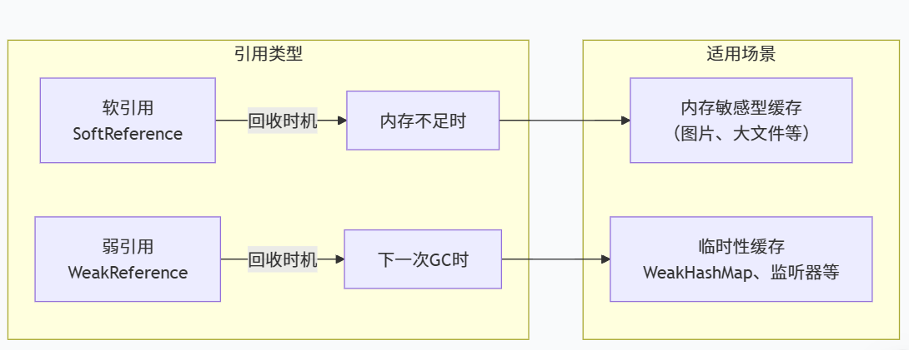
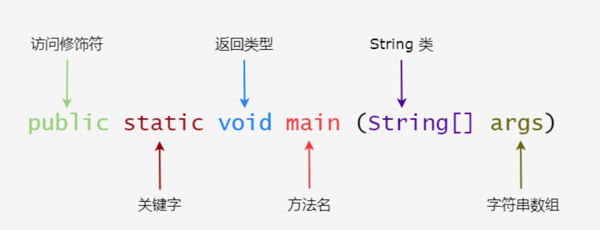

# java基础

##### 面向对象：

* 把世界看成由一个个对象组成，只需要调度各个对象，对象自己知道该干什么

##### 面向过程：

* 先干什么，再干什么，在过程中涉及哪些对象就调用哪些对象
   **最后问一句：** 你现在脑海里，是把“登录功能”想成“一个验证账号密码的流程（过程）”，还是想成“用户对象执行了一个登录的动作（对象）”？

Java面向对象的三大特性包括：**封装、继承、多态**：

- **封装**：封装是指将对象的属性（数据）和行为（方法）结合在一起，对外隐藏对象的内部细节，仅通过对象提供的接口与外界交互。封装的目的是增强安全性和简化编程，使得对象更加独立。
- **继承**：继承是一种可以使得子类自动共享父类数据结构和方法的机制。它是代码复用的重要手段，通过继承可以建立类与类之间的层次关系，使得结构更加清晰。
- **多态**：多态是指允许不同类的对象对同一消息作出响应。即同一个接口，使用不同的实例而执行不同操作。多态性可以分为编译时多态（重载）和运行时多态（重写）。它使得程序具有良好的灵活性和扩展性。

# 多态体现在哪几个方面？

多态在面向对象编程中可以体现在以下几个方面：

## 方法重载：

- 方法重载是指同一类中可以有多个同名方法，它们具有不同的参数列表（参数类型、数量或顺序不同）。虽然方法名相同，但根据传入的参数不同，编译器会在编译时确定调用哪个方法。
- 示例：对于一个 `add` 方法，可以定义为 `add(int a, int b)` 和 `add(double a, double b)`。

## 方法重写：

- 方法重写是指子类能够提供对父类中同名方法的具体实现。在运行时，JVM会根据对象的实际类型确定调用哪个版本的方法。这是实现多态的主要方式。
- 示例：在一个动物类中，定义一个 `sound` 方法，子类 `Dog` 可以重写该方法以实现 `bark`，而 `Cat` 可以实现 `meow`。

## 接口与实现：

- 多态也体现在接口的使用上，多个类可以实现同一个接口，并且用接口类型的引用来调用这些类的方法。这使得程序在面对不同具体实现时保持一贯的调用方式。
- 示例：多个类（如 `Dog`、`Cat`）都实现了一个 `Animal` 接口，当用 `Animal` 类型的引用调用 `makeSound` 方法时，会触发对应的实现。

**接口（Interface）** 是 Java 中一种**引用类型**，它定义了一组**方法签名**，但不提供实现（Java 8+ 可以有默认方法和静态方法）。

## 向上转型和向下转型：

- 在Java中，可以使用**父类类型的引用指向子类对象**，这是向上转型。通过这种方式，可以在运行时采用不同的子类实现。
- 向下转型是将父类引用转回其子类类型，但在执行前需要确认引用实际指向的对象类型以避免ClassCastException

# 抽象类和普通类区别？

- 实例化：普通类可以直接实例化对象，而抽象类不能被实例化，只能被继承。
- 方法实现：普通类中的方法可以有具体的实现，而抽象类中的方法可以有实现也可以没有实现。
- 继承：普通类和抽象类在继承规则上完全一样——都只能被单继承（extends），都可以实现多个接口（implements），这一点两者没有区别。
- 实现限制：普通类可以被其他类继承和使用，而抽象类一般用于作为基类，被其他类继承和扩展使用。

**单继承** 指的是：**一个类只能直接继承一个父类**。

# 集合

**容器（Container）** 是 Java 中用来**存储和管理一组对象**的数据结构统称。在 Java 集合框架中，容器就是各种集合类（Collection）和映射类（Map）。

```
                    ┌── Collection（存放单个元素）
                    │      ├── List（有序、可重复）
                    │      │    ├── ArrayList
                    │      │    ├── LinkedList
                    │      │    └── Vector
                    │      ├── Set（无序、不可重复）
                    │      │    ├── HashSet
                    │      │    ├── LinkedHashSet
                    │      │    └── TreeSet
                    │      └── Queue（队列）
                    │           └── PriorityQueue
                    │
Java 容器（集合框架）
                    │
                    └── Map（存放 Key-Value 键值对）
                         ├── HashMap
                         ├── LinkedHashMap
                         ├── TreeMap
                         ├── WeakHashMap
                         └── ConcurrentHashMap
```

存单个元素和存键值对的区别

**为什么集合里面没有栈？**

原先有专门的一个类，后来out了，现代 Java 推荐使用 `Deque`（双端队列）接口及其实现类（如 `ArrayDeque`）来作为栈的替代品。

### 为什么叫"容器"而不叫"数组"？

|          | 数组                        | 容器（集合）                       |
| :------- | :-------------------------- | :--------------------------------- |
| 长度     | 固定，创建后不能变          | 动态扩容                           |
| 存储类型 | 可以是基本类型（int）或对象 | 只能存储对象（泛型）               |
| 操作方法 | 只有 `length` 和下标访问    | 丰富的 API（增删改查、排序、遍历） |
| 灵活性   | 低                          | 高                                 |

```
          Iterable (接口)
              ↓
          Collection (接口)
              ↓
            List (接口) ←── 我们讨论的 List 接口
          /     |     \
   ArrayList  LinkedList  Vector (历史类)
       ↓           ↓          ↓
   (数组)      (链表)     (同步数组)
```

### List 与 Set 的核心区别

|              | **List**                       | **Set**                                   |
| :----------- | :----------------------------- | :---------------------------------------- |
| **顺序**     | ✅ 有序（插入顺序）             | ❌ 无序（HashSet）/ 排序（TreeSet）        |
| **重复**     | ✅ 允许重复                     | ❌ 不允许重复                              |
| **索引**     | ✅ 有下标，支持随机访问         | ❌ 无下标                                  |
| **判断依据** | 不判断重复，直接添加           | `hashCode()` + `equals()` / `compareTo()` |
| **适用场景** | 存储有序列表、购物车、消息队列 | 去重、黑名单、标签集合                    |

# *ArrayList*

#### 就是一个自动扩容的数组，查改快，增删慢（动一个所有的都跟着挪

#### **底层采用数组实现**

```java
/**
     * The array buffer into which the elements of the ArrayList are stored.
     * The capacity of the ArrayList is the length of this array buffer. Any
     * empty ArrayList with elementData == DEFAULTCAPACITY_EMPTY_ELEMENTDATA
     * will be expanded to DEFAULT_CAPACITY when the first element is added.
     */
    transient Object[] elementData; // non-private to simplify nested class access

    /**
     * The size of the ArrayList (the number of elements it contains).
     *
     * @serial
     */
    private int size;
```

**transient**

`transient` 是 Java 中的一个**字段修饰符**，用于**标记某个实例变量不参与序列化**。

**序列化 = 把 Java 对象「拍扁」成字节流，以便存储到文件或通过网络传输。反序列化 = 把字节流「还原」回 Java 对象。**

- `Object[]` 可以存储**任何对象**（因为所有类都继承自 `Object`）。
- 但不能存基本类型（`int`、`boolean` 等），需要包装类。

**`size` 记录了 `ArrayList` 当前实际包含的元素个数。**

#### **构造函数（用来初始化的）**

```java
/**
     * Constructs an empty list with the specified initial capacity.
     *
     * @param  initialCapacity  the initial capacity of the list
     * @throws IllegalArgumentException if the specified initial capacity
     *         is negative
     */
    public ArrayList(int initialCapacity) {
        if (initialCapacity > 0) {
            this.elementData = new Object[initialCapacity];
        } else if (initialCapacity == 0) {
            this.elementData = EMPTY_ELEMENTDATA;
        } else {
            throw new IllegalArgumentException("Illegal Capacity: "+
                                               initialCapacity);
        }
    }

    /**
     * Constructs an empty list with an initial capacity of ten.
     */
    public ArrayList() {
        this.elementData = DEFAULTCAPACITY_EMPTY_ELEMENTDATA;
    }

    /**
     * Constructs a list containing the elements of the specified
     * collection, in the order they are returned by the collection's
     * iterator.
     *
     * @param c the collection whose elements are to be placed into this list
     * @throws NullPointerException if the specified collection is null
     */
    public ArrayList(Collection<? extends E> c) {
        //构造方法名+参数类型
        elementData = c.toArray();
        if ((size = elementData.length) != 0) {
            // c.toArray might (incorrectly) not return Object[] (see 6260652)
            if (elementData.getClass() != Object[].class)
                elementData = Arrays.copyOf(elementData, size, Object[].class);
        } else {
            // replace with empty array.
            this.elementData = EMPTY_ELEMENTDATA;
        }
    }
```

在ArrayList的源码里为什么会有ArrayList方法？

**因为它叫"构造方法"（Constructor），是 Java 语法规定的特殊方法，专门用于创建对象时初始化对象的状态。**

#### 自动扩容

```java
/**
     * Increases the capacity of this <tt>ArrayList</tt> instance, if
     * necessary, to ensure that it can hold at least the number of elements
     * specified by the minimum capacity argument.
     *
     * @param   minCapacity   the desired minimum capacity
     */
    public void ensureCapacity(int minCapacity) {
        int minExpand = (elementData != DEFAULTCAPACITY_EMPTY_ELEMENTDATA)
            // any size if not default element table
            ? 0
            // larger than default for default empty table. It's already
            // supposed to be at default size.
            : DEFAULT_CAPACITY;

        if (minCapacity > minExpand) {
            ensureExplicitCapacity(minCapacity);
        }
    }

    private void ensureCapacityInternal(int minCapacity) {
        if (elementData == DEFAULTCAPACITY_EMPTY_ELEMENTDATA) {
            minCapacity = Math.max(DEFAULT_CAPACITY, minCapacity);
        }

        ensureExplicitCapacity(minCapacity);
    }

    private void ensureExplicitCapacity(int minCapacity) {
        modCount++;

        // overflow-conscious code
        if (minCapacity - elementData.length > 0)
            grow(minCapacity);
    }

    /**
     * The maximum size of array to allocate.
     * Some VMs reserve some header words in an array.
     * Attempts to allocate larger arrays may result in
     * OutOfMemoryError: Requested array size exceeds VM limit
     */
    private static final int MAX_ARRAY_SIZE = Integer.MAX_VALUE - 8;

    /**
     * Increases the capacity to ensure that it can hold at least the
     * number of elements specified by the minimum capacity argument.
     *
     * @param minCapacity the desired minimum capacity
     */
    private void grow(int minCapacity) {
        // overflow-conscious code
        int oldCapacity = elementData.length;
        int newCapacity = oldCapacity + (oldCapacity >> 1);
        if (newCapacity - minCapacity < 0)
            newCapacity = minCapacity;
        if (newCapacity - MAX_ARRAY_SIZE > 0)
            newCapacity = hugeCapacity(minCapacity);
        // minCapacity is usually close to size, so this is a win:
        elementData = Arrays.copyOf(elementData, newCapacity);
    }

    private static int hugeCapacity(int minCapacity) {
        if (minCapacity < 0) // overflow
            throw new OutOfMemoryError();
        return (minCapacity > MAX_ARRAY_SIZE) ?
            Integer.MAX_VALUE :
            MAX_ARRAY_SIZE;
    }
```

**完整扩容流程**

```
用户调用 add()
       ↓
ensureCapacityInternal(size + 1)   ← 第1步：计算最小需要容量
       ↓
判断是否首次添加（延迟初始化）
       ↓
ensureExplicitCapacity(minCapacity)  ← 第2步：判断是否需要扩容
       ↓
if (minCapacity - elementData.length > 0)  ← 容量不够？
       ↓ 是
grow(minCapacity)   ← 第3步：执行扩容
       ↓
计算新容量 = oldCapacity + (oldCapacity >> 1)  ← 扩容 1.5 倍
       ↓
如果新容量还小于 minCapacity，则直接取 minCapacity
       ↓
Arrays.copyOf(elementData, newCapacity)  ← 创建新数组并复制
       ↓
返回新数组，旧数组被 GC 回收
       ↓
存入新元素，size++
```

# LinkedList

### List 接口：有序的“序列”

`List` 是最常用的集合接口之一，它的核心特点是：

- **有序**：元素有固定的顺序，你放进去是什么顺序，取出来就是什么顺序（除非你主动排序）。
- **可重复**：可以存储相同的元素（比如两个“苹果”）。
- **有索引**：每个元素都有一个数字下标（从0开始），你可以通过 `get(index)` 直接访问。

###  Deque 接口：双端操作的“队列”

`Deque` 是 “Double Ended Queue”（双端队列）的缩写。它的核心特点是：

- **支持两端操作**：你既可以**在头部**添加/获取/移除元素，也可以**在尾部**做同样的操作。
- **既可作为队列（FIFO）**：遵循先进先出（First-In-First-Out），就像排队。
- **也可作为栈（LIFO）**：遵循后进先出（Last-In-First-Out），就像叠盘子。

### 栈

- **定义**：栈是一种**操作受限**的线性表。它限制仅在表的一端（称为**栈顶 Top**）进行插入和删除操作，另一端称为**栈底 Bottom**。
- **核心法则**：**LIFO（后进先出）**。最后被压入栈的元素，必定最先被弹出。
- **抽象数学模型**：满足以下递推关系——若栈中有元素，则删除操作删除的必然是最近一次插入操作所插入的元素。

**有一个first指向第一个node**

关于first的性质

```
 transient Node<E> first;
```

first相当于只是一个变量，存放着第一个node的地址

也就是

```java
Node<E> first;          // 这只是一个引用（遥控器）
Node<E> first = new Node<>(...); // 这行既声明了遥控器，又创建了真实节点
```

的区别，一个开创了真实的空间来存放数据和指针，另一个只是引用

#### *LinkedList*底层**通过双向链表实现**

## 引用

定义：**引用（Reference）是一个存储着对象内存地址的变量，它是 JVM 堆中对象的句柄（Handle），用于间接访问和操作目标对象。引用本身是类型安全的，且不参与指针算术运算。**

引用的作用：

* 通过代码的方式决定某个对象的生命周期
* 有利于垃圾回收机制进行垃圾回收

### 强引用

**强引用是 Java 中最普遍的引用类型。只要一个对象被至少一个强引用所指向，那么垃圾回收器（GC）就无论如何都不会回收该对象的内存，即使 JVM 内存已经不足（此时 JVM 宁愿抛出 `OutOfMemoryError` 崩溃，也不会回收强引用对象）。**

```java
// student 就是一个强引用，牢牢"抓住"了堆内存中的 Student 对象
Student student = new Student(); 

// 数组也是强引用
int[] numbers = new int[100]; 
```

强引用的生命周期完全由**作用域（Scope）**和**显式赋值**决定：

- **存活条件**：只要强引用还在方法的局部变量表中，或者被静态变量持有，对象就永远存活。
- **回收条件**：只有当强引用被主动置为 `null`，或者所在的方法执行完毕，栈帧弹出，强引用消失，对象失去了"抓手"，才会变为"可回收"状态。

```java
public void test() {
    Student s = new Student(); // 强引用产生
    // ... 使用 s
    s = null; // 主动切断强引用，对象现在可以被 GC 回收了
    // 或者方法执行完毕，s 自动出栈，对象也可以被回收
}
```

### 软引用

**软引用是比强引用更弱的引用类型。它通过 `java.lang.ref.SoftReference` 类实现。被软引用指向的对象，在系统内存充足时不会被回收；但在系统即将发生内存溢出（OOM）之前，垃圾回收器会将这些软引用对象列入回收范围，进行清理以腾出空间。**

内存多就存在，内存少就回收

超级适合缓存

软引用不能直接用 `new`，必须包装在 `SoftReference` 对象里：

```java
// 1. 创建一个强引用对象
Object obj = new Object();

// 2. 把 obj 包装成软引用
SoftReference<Object> softRef = new SoftReference<>(obj);

// 3. 切断强引用（这一步很关键！）
obj = null; 

// 4. 获取软引用指向的对象
Object cachedObj = softRef.get();
if (cachedObj == null) {
    // 说明内存不足，对象已被 GC 回收，需要重新创建
    cachedObj = new Object();
    softRef = new SoftReference<>(cachedObj);
} else {
    // 对象还在，直接使用
    System.out.println("缓存命中！");
}
```


**关键点**：`softRef.get()` 方法可能在内存紧张时返回 `null`，因此使用时**必须做判空处理**。

**注意**：软引用对象的回收时机**不是**内存一紧张就立刻回收，而是在 JVM 决定抛出 `OutOfMemoryError` **之前**的那次 Full GC 中统一处理。

1. **必须显式切断强引用**：如果你只创建了 `SoftReference` 却没有把原来的强引用置 `null`，那这个对象同时被强引用和软引用持有——**强引用优先级更高，GC 永远不会回收它**，软引用就形同虚设了。
2. **`get()` 可能返回 `null`**：这是正常现象，代码里必须写降级逻辑（重新创建对象）。
3. **不要用于核心业务数据**：如果你依赖的对象必须存在（比如用户登录态），用软引用会导致诡异的数据丢失 bug——应该用强引用。

### GC

**就是垃圾回收**

### 弱引用

**弱引用（Weak Reference）通过 `java.lang.ref.WeakReference` 类实现。被弱引用指向的对象，生命周期只持续到下一次垃圾回收发生之前。无论当前内存是否充足，只要 GC 线程开始工作，该对象就会被回收。**

#### 2. 如何使用弱引用

```java
import java.lang.ref.WeakReference;

public class WeakReferenceDemo {
    public static void main(String[] args) {
        // 1. 创建一个强引用对象
        Object obj = new Object();
        
        // 2. 包装成弱引用
        WeakReference<Object> weakRef = new WeakReference<>(obj);
        
        // 3. 切断强引用（关键步骤！）
        obj = null;
        
        // 4. GC 前，弱引用还能拿到对象
        System.out.println("GC前: " + weakRef.get());  // 输出: java.lang.Object@xxx
        
        // 5. 触发 GC
        System.gc();
        
        // 6. GC 后，弱引用对象被回收
        System.out.println("GC后: " + weakRef.get());  // 输出: null
    }
}
```

**关键点**：`weakRef.get()` 在 GC 后立即返回 `null`，比软引用（内存不足才收）**回收得更激进**。

```java
  // 2. 包装成弱引用
        WeakReference<Object> weakRef = new WeakReference<>(obj);
```

**结构如下**

```java
WeakReference<Object> weakRef   =   new WeakReference<>(obj);
│                  │       │          │                  │
│                  │       │          │                  └── 传入被包装的对象 obj
│                  │       │          └── 调用构造方法（泛型自动推断）
│                  │       └── 变量名
│                  └── 泛型类型参数（这个弱引用包装的是什么类型的对象）
└── 类名（java.lang.ref.WeakReference）
```

**翻译成人话**：

> "我创建了一个专门用来装 `Object` 类型对象的弱引用容器，这个容器叫 `weakRef`，它里面弱引用地指向了外面那个 `obj` 对象。"

**	**

```
栈内存（Stack）                    堆内存（Heap）
┌─────────────────┐               ┌─────────────────────┐
│ obj (强引用)      │──────────────│   Object 对象本身    │
│ 指向堆中的对象    │               │  (实际数据)          │
├─────────────────┤               └─────────────────────┘
│ weakRef          │                    ▲
│ (弱引用容器)     │                    │
└─────────────────┘                    │ 弱引用指向
         │                              │
         └─────── 实际上 WeakReference 内部有一个成员变量 referent，
                 它用弱引用指向了堆中的 Object 对象
```

**关键点**：

1. **`obj` 是强引用**：只要 `obj` 还在，堆里的 `Object` 对象**绝对安全**，GC 不敢动它。
2. **`weakRef` 是弱引用容器**：它内部持有了对 `Object` 对象的**弱引用**。
3. **此时对象有两条引用链**：
   - 强引用链：`obj` → `Object 对象`
   - 弱引用链：`weakRef` → `Object 对象`

**最重要的一句话**：只要强引用 `obj` 还在，这个对象就不会被回收；如果 `obj = null` 了，那么对象只剩下弱引用，下次 GC 就会回收它。

#### 3. 软引用 vs 弱引用（核心区别）

| 对比维度     | 软引用（SoftReference）  | 弱引用（WeakReference）              |
| :----------- | :----------------------- | :----------------------------------- |
| **回收时机** | 内存**不足时**（OOM 前） | **下一次 GC**（无论内存是否充足）    |
| **存活时长** | 能活到内存紧张为止       | 活不过一次 GC                        |
| **典型用途** | 缓存（图片、大文件）     | 元数据、监听器、ThreadLocal          |
| **适用场景** | "丢了重建代价大"         | "丢了可以随时重建，且不应该影响内存" |

**缓存应该用软引用还是弱引用？**

答案是看情况



#### 弱引用的实际应用

==ThreadLocal和WeakHashMap==

### 虚引用

> **虚引用（Phantom Reference）通过 `java.lang.ref.PhantomReference` 类实现。它是最弱的一种引用，** `get()` 方法永远返回 `null` **。你无法通过虚引用访问到对象本身，它存在的唯一意义是：当对象被 GC 回收后，虚引用会被放入关联的**引用队列（ReferenceQueue）**，从而通知你“这个对象已经被回收了”。**

**白话版**：虚引用就像是**对象被回收时的“短信通知”**，它自己不持有对象，只负责告诉你“对象没了”。

#### 2. 如何使用虚引用

```java
import java.lang.ref.PhantomReference;
import java.lang.ref.ReferenceQueue;

public class PhantomReferenceDemo {
    public static void main(String[] args) {
        // 1. 创建对象
        Object obj = new Object();
        
        // 2. 创建引用队列（虚引用必须配合队列使用）
        ReferenceQueue<Object> queue = new ReferenceQueue<>();
        
        // 3. 创建虚引用（注意：构造时必须传入队列）
        PhantomReference<Object> phantomRef = new PhantomReference<>(obj, queue);
        
        // 4. 切断强引用
        obj = null;
        
        // 5. 虚引用的 get() 永远返回 null
        System.out.println(phantomRef.get());  // 永远输出: null
        
        // 6. 触发 GC
        System.gc();
        
        // 7. 从队列中取出被回收的虚引用
        // 注意：需要循环等待，或者用 queue.remove() 阻塞等待
        Reference<?> ref = queue.poll();  // 非阻塞
        if (ref != null) {
            System.out.println("对象已被 GC 回收！");
            // 在这里执行清理工作
        }
    }
}
```


**关键语法点**：

- **必须传入 `ReferenceQueue`**：虚引用构造时强制要求传入队列，没有例外。
- **`get()` 永远返回 `null`**：即使对象还活着，你也拿不到它。

#### 虚引用的唯一用途：资源清理

==NIO==

==**JVM 的 GC Roots 可达性分析算法**（怎么判定一个对象是"垃圾"）==


回归linked list

### getFirst(), getLast()

获取第一个元素， 和获取最后一个元素:

```java
    /**
     * Returns the first element in this list.
     *
     * @return the first element in this list
     * @throws NoSuchElementException if this list is empty
     */
    public E getFirst() {
        final Node<E> f = first;
        if (f == null)
            throw new NoSuchElementException();
        return f.item;
    }

    /**
     * Returns the last element in this list.
     *
     * @return the last element in this list
     * @throws NoSuchElementException if this list is empty
     */
    public E getLast() {
        final Node<E> l = last;
        if (l == null)
            throw new NoSuchElementException();
        return l.item;
    }
```

### addAll()批量插入一组元素

```java
/**
 * 将指定集合中的所有元素添加到此列表的尾部。
 * 这是 addAll 方法的便利版本，自动在列表末尾插入。
 * 
 * @param c 包含要添加到此列表的元素的集合
 * @return {@code true} 如果此列表因调用而发生变化（即集合非空）
 */
public boolean addAll(Collection<? extends E> c) {
    // 调用带索引的 addAll 方法，传入当前列表大小作为插入位置
    // 因为索引等于 size，所以实际上是在列表尾部追加所有元素
    return addAll(size, c);
}

/**
 * 将指定集合中的所有元素插入到此列表中，从指定位置开始。
 * 将该位置及其后续元素向右移动（索引增加）。
 * 新元素将按照指定集合的迭代器返回的顺序出现在列表中。
 *
 * @param index 要插入第一个元素的索引位置
 * @param c 包含要添加到此列表的元素的集合
 * @return {@code true} 如果此列表因调用而发生变化
 * @throws IndexOutOfBoundsException 如果索引超出范围 (index < 0 || index > size)
 * @throws NullPointerException 如果指定的集合为 null
 */
public boolean addAll(int index, Collection<? extends E> c) {
    // 1. 检查索引是否有效：确保 0 <= index <= size
    checkPositionIndex(index);

    // 2. 将传入的集合转换为数组
    //    这样做有两个好处：
    //    - 防止在遍历过程中原集合被修改（ConcurrentModificationException）
    //    - 如果集合是链表结构，转换为数组可以提高遍历效率
    Object[] a = c.toArray();
    int numNew = a.length;  // 获取要插入的元素数量
    
    // 3. 如果集合为空，直接返回 false，表示没有变化
    if (numNew == 0)
        return false;

    // 4. 定义两个节点引用：pred（前驱）和 succ（后继）
    Node<E> pred, succ;
    
    // 5. 根据插入位置确定前驱和后继节点
    if (index == size) {
        // 情况1：在列表尾部插入
        succ = null;        // 后继节点为 null（因为尾部后面没有节点）
        pred = last;        // 前驱节点为当前的尾节点
    } else {
        // 情况2：在列表中间插入
        succ = node(index); // 找到索引位置的节点作为后继节点
        pred = succ.prev;   // 前驱节点为后继节点的前一个节点
    }//元素编成链表后集体插入，所以只需要定位一次前驱和后继

    // 6. 遍历数组，逐个创建新节点并链接到链表中
    for (Object o : a) {
        // 类型转换：将 Object 转为泛型类型 E
        @SuppressWarnings("unchecked") 
        E e = (E) o;
        
        // 创建新节点：前驱为 pred，元素为 e，后继为 null
        Node<E> newNode = new Node<>(pred, e, null);
        
        if (pred == null) {
            // 如果前驱为 null，说明新节点是链表头节点
            first = newNode;
        } else {
            // 否则将前驱节点的 next 指向新节点
            pred.next = newNode;
        }
        
        // 更新前驱指针为新节点，为下一个元素的插入做准备
        pred = newNode;
    }

    // 7. 连接尾部：将最后一个新节点与后继节点连接
    if (succ == null) {
        // 如果是在尾部插入（succ == null）
        // 则最后一个新节点成为新的尾节点
        last = pred;
    } else {
        // 如果是在中间插入，需要连接：
        // 最后一个新节点 <-> 原来的后继节点
        pred.next = succ;
        succ.prev = pred;
    }

    // 8. 更新列表大小：增加 numNew 个元素
    size += numNew;
    
    // 9. 增加修改计数器：用于 fail-fast 机制
    //    当迭代器遍历时检测到 modCount 变化会抛出 ConcurrentModificationException
    modCount++;
    
    // 10. 返回 true，表示列表发生了变化
    return true;
}
```

## linked list和队列方法什么关系？

linked list是一个类，实现了很多接口，实现接口的意思就是能当这个东西用，就比如说linked list实现了queue接口，它就可以当作一个队列来使用了

#### LinkedList 能当什么用？

```java
LinkedList<String> list = new LinkedList<>();

// 1. 当 List 用（列表）
List<String> asList = list;
asList.add("A");
asList.get(0);
asList.set(0, "B");
asList.remove(0);

// 2. 当 Queue 用（队列 - FIFO）
Queue<String> asQueue = list;
asQueue.offer("A");    // 入队
asQueue.poll();        // 出队
asQueue.peek();        // 查看队头

// 3. 当 Deque 用（双端队列）
Deque<String> asDeque = list;
asDeque.addFirst("A");   // 头部插入
asDeque.addLast("B");    // 尾部插入
asDeque.pollFirst();     // 头部移除
asDeque.pollLast();      // 尾部移除

// 4. 当 Collection 用（集合）
Collection<String> asCollection = list;
asCollection.add("A");
asCollection.remove("A");
asCollection.size();
asCollection.isEmpty();

// 5. 当 Iterable 用（可迭代）
Iterable<String> asIterable = list;
for (String s : asIterable) {
    System.out.println(s);
}

// 6. 当 Object 用（所有类的父类）
Object asObject = list;
asObject.toString();
asObject.hashCode();
```

```
                    ┌─────────────────────┐
                    │   LinkedList对象    │
                    │   [C, A, B]         │
                    └─────────────────────┘
                           │
        ┌──────────────────┼──────────────────┐
        │                  │                  │
   作为 List 看        作为 Queue 看      作为 Deque 看
   ┌────────────┐     ┌────────────┐     ┌────────────┐
   │可以做的事情：│     │可以做的事情：│     │可以做的事情：│
   │ add()      │     │ offer()    │     │ addFirst() │
   │ get(index) │     │ poll()     │     │ addLast()  │
   │ set(index) │     │ peek()     │     │ pollFirst()│
   │ remove(index)│    │ remove()   │     │ pollLast() │
   │ size()     │     │ element()  │     │ push()     │
   └────────────┘     └────────────┘     └────────────┘
        ↑                  ↑                  ↑
        └──────────────────┴──────────────────┘
                操作的都是同一个对象！
```

### linked list方法按照接口分类

```
LinkedList 方法分类：
┌─────────────────────────────────────────────┐
│                LinkedList                    │
├─────────────────┬──────────────     ┬─────────────┤
│   List 方法      │  Queue方法（队列）  │  Deque 方法 
│                                         （双向队列）
├─────────────────┼──────────────     ┼─────────────┤
│ add(e)          │ offer(e)          │ addFirst    │
│ add(index, e)   │ poll()            │ addLast     │
│ get(index)      │ peek()            │ offerFirst  │
│ set(index, e)   │ remove()          │ offerLast   │
│ remove(index)   │ element()         │ pollFirst   │
│ remove(Object)  │                   │ pollLast    │
│ indexOf(Object) │                   │ peekFirst   │
│ contains()      │                   │ peekLast    │
│ size()          │                   │ removeFirst │
│ isEmpty()       │                   │ removeLast  │
│ clear()         │                   │ getFirst    │
│ iterator()      │                   │ getLast     │
│                 │                   │ push/pop    │
└─────────────────┴──────────────┴─────────────┘
```

==好像只看了实现原理没看怎么使用，挠头==

==了解他们的原理是什么，所以特性是什么，分析我的场景需求是什么，然后匹配，选择合适的那个应用==

# **ArrayDeque **

**动态循环数组实现的双端队列**

既能当栈用又能当队列用

# PriorityQueue

**基于完全二叉树实现的小顶堆的优先队列，每次都取出权值最小的那个，底层使用数组实现**

父子节点编号关系

```java
leftNo = parentNo*2+1
rightNo = parentNo*2+2
parentNo = (nodeNo-1)/2
```

### remove()和poll()

获取并删除队首元素，区别是当方法失败时前者抛出异常，后者返回`null`

**删除元素代码实现**

```java
public E poll() {
    if (size == 0)
        return null;
    int s = --size;
    modCount++;
    E result = (E) queue[0];//0下标处的那个元素就是最小的那个
    E x = (E) queue[s];
    queue[s] = null;
    if (s != 0)
        siftDown(0, x);//调整
    return result;
}
//1 拿走最小的
//2 把最后一个元素放到堆顶
//3 下沉调整
```

### add()和offer()

向优先队列中插入元素，只是`Queue`接口规定二者对插入失败时的处理不同，前者在插入失败时抛出异常，后则则会返回`false`

```java
//offer(E e)
public boolean offer(E e) {
    if (e == null)//不允许放入null元素
        throw new NullPointerException();
    modCount++;
    int i = size;
    if (i >= queue.length)
        grow(i + 1);//自动扩容
    size = i + 1;
    if (i == 0)//队列原来为空，这是插入的第一个元素
        queue[0] = e;
    else
        siftUp(i, e);//调整
    return true;
}

```

### remove(Object o)

删除队列中跟`o`相等的某一个元素(如果有多个相等，只删除一个)

具体来说，`remove(Object o)`可以分为2种情况: 1. 删除的是最后一个元素。直接删除即可，不需要调整。2. 删除的不是最后一个元素，从删除点开始以最后一个元素为参照调用一次`siftDown()`即可。

==一个方法，应该掌握用法和原理==

# HashMap

`HashMap` 的底层实现是 **基于哈希表的 `Map` 接口实现**，在 Java 8 及以后版本中，其数据结构为 **数组 + 链表 + 红黑树** 的组合。它通过 **哈希函数** 将键映射到数组的某个桶（Bucket）上，并使用 **链地址法** 来处理哈希冲突。

**桶是什么？**

在 `HashMap` 等基于哈希表的数据结构中，**桶（Bucket）** 是**哈希表主干数组 `table` 中的一个存储槽位（Slot）**。它是数据存储的基本单元，用于存放一个或多个键值对（Key-Value Pair）节点。

#### 一个key只能对应一个value，那为什么还需要链表？

实际上，这里的“多个Entry”代表的是**不同的Key**。它们因为**哈希冲突**被放在了同一个桶里，但逻辑上每个Key仍然是独立且唯一的。链表是解决这个物理冲突的技术手段。

| 层面                     | 规则                                             | 说明                                                         |
| :----------------------- | :----------------------------------------------- | :----------------------------------------------------------- |
| **逻辑层面（Map契约）**  | 一个 Key → 唯一的一个 Value                      | 这是你使用 `Map` 时遵循的规则。Key 是唯一的。                |
| **物理层面（存储结构）** | 一个桶（数组槽位）→ 可能存放多个 Entry（键值对） | 这是哈希表为了**处理冲突**而采用的技术手段。这多个 Entry 的 Key 必定**不同**。 |

**链表存在的唯一目的，就是处理“哈希冲突”**：当两个完全不同的 Key（如 `"张三"` 和 `"张四"`）通过哈希函数计算后，不幸得到了**相同的数组下标**，它们就必须被放入同一个桶里。链表就把它们串起来，共存在这个桶中。

### ==resize() ，源码好难不想看==

**扩容并复制数据**

```java
final Node<K,V>[] resize() {
    Node<K,V>[] oldTab = table;
    int oldCap = (oldTab == null) ? 0 : oldTab.length;
    int oldThr = threshold;
    int newCap, newThr = 0;
    if (oldCap > 0) { // 对应数组扩容
        if (oldCap >= MAXIMUM_CAPACITY) {
            threshold = Integer.MAX_VALUE;
            return oldTab;
        }
        // 将数组大小扩大一倍
        else if ((newCap = oldCap << 1) < MAXIMUM_CAPACITY &&
                 oldCap >= DEFAULT_INITIAL_CAPACITY)
            // 将阈值扩大一倍
            newThr = oldThr << 1; // double threshold
    }
    else if (oldThr > 0) // 对应使用 new HashMap(int initialCapacity) 初始化后，第一次 put 的时候
        newCap = oldThr;
    else {// 对应使用 new HashMap() 初始化后，第一次 put 的时候
        newCap = DEFAULT_INITIAL_CAPACITY;
        newThr = (int)(DEFAULT_LOAD_FACTOR * DEFAULT_INITIAL_CAPACITY);
    }

    if (newThr == 0) {
        float ft = (float)newCap * loadFactor;
        newThr = (newCap < MAXIMUM_CAPACITY && ft < (float)MAXIMUM_CAPACITY ?
                  (int)ft : Integer.MAX_VALUE);
    }
    threshold = newThr;

    // 用新的数组大小初始化新的数组
    Node<K,V>[] newTab = (Node<K,V>[])new Node[newCap];
    table = newTab; // 如果是初始化数组，到这里就结束了，返回 newTab 即可

    if (oldTab != null) {
        // 开始遍历原数组，进行数据迁移。
        for (int j = 0; j < oldCap; ++j) {
            Node<K,V> e;
            if ((e = oldTab[j]) != null) {
                oldTab[j] = null;
                // 如果该数组位置上只有单个元素，那就简单了，简单迁移这个元素就可以了
                if (e.next == null)
                    newTab[e.hash & (newCap - 1)] = e;
                // 如果是红黑树，具体我们就不展开了
                else if (e instanceof TreeNode)
                    ((TreeNode<K,V>)e).split(this, newTab, j, oldCap);
                else { 
                    // 这块是处理链表的情况，
                    // 需要将此链表拆成两个链表，放到新的数组中，并且保留原来的先后顺序
                    // loHead、loTail 对应一条链表，hiHead、hiTail 对应另一条链表，代码还是比较简单的
                    Node<K,V> loHead = null, loTail = null;
                    Node<K,V> hiHead = null, hiTail = null;
                    Node<K,V> next;
                    do {
                        next = e.next;
                        if ((e.hash & oldCap) == 0) {
                            if (loTail == null)
                                loHead = e;
                            else
                                loTail.next = e;
                            loTail = e;
                        }
                        else {
                            if (hiTail == null)
                                hiHead = e;
                            else
                                hiTail.next = e;
                            hiTail = e;
                        }
                    } while ((e = next) != null);
                    if (loTail != null) {
                        loTail.next = null;
                        // 第一条链表
                        newTab[j] = loHead;
                    }
                    if (hiTail != null) {
                        hiTail.next = null;
                        // 第二条链表的新的位置是 j + oldCap，这个很好理解
                        newTab[j + oldCap] = hiHead;
                    }
                }
            }
        }
    }
    return newTab;
}

```

### put

```java
put(key, value)
    │
    ├─ 1. 哈希表为空？ → 是 → 初始化（resize）
    │
    ├─ 2. 计算下标，对应桶为空？ → 是 → 创建新节点放入，跳到步骤5
    │
    ├─ 3. 桶不为空（发生冲突）
    │     ├─ 头节点 Key 相同？ → 是 → 记录该节点 e
    │     ├─ 桶为红黑树？ → 是 → 调用红黑树插入，记录 e
    │     └─ 桶为链表
    │           ├─ 遍历链表
    │           │    ├─ 找到相同 Key → 记录 e，跳出
    │           │    └─ 到链尾 → 创建新节点挂末尾，检查是否转红黑树
    │           └─ (结束)
    │
    ├─ 4. e 不为 null？（Key 已存在）
    │     └─ 是 → 覆盖 Value，返回旧 Value
    │
    ├─ 5. 是新增元素 → 修改计数 modCount++，size++ 并检查扩容
    │
    └─ 6. 返回 null（表示成功插入新键值对）


public V put(K key, V value) {
    return putVal(hash(key), key, value, false, true);
}

// 第四个参数 onlyIfAbsent 如果是 true，那么只有在不存在该 key 时才会进行 put 操作
// 第五个参数 evict 我们这里不关心
final V putVal(int hash, K key, V value, boolean onlyIfAbsent,
               boolean evict) {
    Node<K,V>[] tab; Node<K,V> p; int n, i;
    // 第一次 put 值的时候，会触发下面的 resize()，类似 java7 的第一次 put 也要初始化数组长度
    // 第一次 resize 和后续的扩容有些不一样，因为这次是数组从 null 初始化到默认的 16 或自定义的初始容量
    if ((tab = table) == null || (n = tab.length) == 0)
        n = (tab = resize()).length;
    // 找到具体的数组下标，如果此位置没有值，那么直接初始化一下 Node 并放置在这个位置就可以了
    if ((p = tab[i = (n - 1) & hash]) == null)
        tab[i] = newNode(hash, key, value, null);

    else {// 数组该位置有数据
        Node<K,V> e; K k;
        // 首先，判断该位置的第一个数据和我们要插入的数据，key 是不是"相等"，如果是，取出这个节点
        if (p.hash == hash &&
            ((k = p.key) == key || (key != null && key.equals(k))))
            e = p;
        // 如果该节点是代表红黑树的节点，调用红黑树的插值方法，本文不展开说红黑树
        else if (p instanceof TreeNode)
            e = ((TreeNode<K,V>)p).putTreeVal(this, tab, hash, key, value);
        else {
            // 到这里，说明数组该位置上是一个链表
            for (int binCount = 0; ; ++binCount) {
                // 插入到链表的最后面(Java7 是插入到链表的最前面)
                if ((e = p.next) == null) {
                    p.next = newNode(hash, key, value, null);
                    // TREEIFY_THRESHOLD 为 8，所以，如果新插入的值是链表中的第 8 个
                    // 会触发下面的 treeifyBin，也就是将链表转换为红黑树
                    if (binCount >= TREEIFY_THRESHOLD - 1) // -1 for 1st
                        treeifyBin(tab, hash);
                    break;
                }
                // 如果在该链表中找到了"相等"的 key(== 或 equals)
                if (e.hash == hash &&
                    ((k = e.key) == key || (key != null && key.equals(k))))
                    // 此时 break，那么 e 为链表中[与要插入的新值的 key "相等"]的 node
                    break;
                p = e;
            }
        }
        // e!=null 说明存在旧值的key与要插入的key"相等"
        // 对于我们分析的put操作，下面这个 if 其实就是进行 "值覆盖"，然后返回旧值
        if (e != null) {
            V oldValue = e.value;
            if (!onlyIfAbsent || oldValue == null)
                e.value = value;
            afterNodeAccess(e);
            return oldValue;
        }
    }
    ++modCount;
    // 如果 HashMap 由于新插入这个值导致 size 已经超过了阈值，需要进行扩容
    if (++size > threshold)
        resize();
    afterNodeInsertion(evict);
    return null;
}
```

## HashSet

*HashSet*是对*HashMap*的简单包装，对*HashSet*的函数调用都会转换成合适的*HashMap*方法

# LinkedHashSet&Map

事实上*LinkedHashMap*是*HashMap*的直接子类，**二者唯一的区别是\*LinkedHashMap\*在\*HashMap\*的基础上，采用双向链表(doubly-linked list)的形式将所有`entry`连接起来，这样是为保证元素的迭代顺序跟插入顺序相同**。

除了可以保迭代历顺序，这种结构还有一个好处 : **迭代\*LinkedHashMap\*时不需要像\*HashMap\*那样遍历整个`table`，而只需要直接遍历`header`指向的双向链表即可**，也就是说*LinkedHashMap*的迭代时间就只跟`entry`的个数相关，而跟`table`的大小无关。

**table是什么，entry是什么，table是什么，bucket是什么？**

**`Entry` 是一组键值对，`Node` 是它的具体实现，而 `table` 是存放这些 `Node` 对象的数组。把 table 数组想象成一个一排的储物柜，那么其中的每一个格子，就是一个 bucket（桶）**


### put()

`put(K key, V value)`方法是将指定的`key, value`对添加到`map`里。该方法首先会对`map`做一次查找，看是否包含该元组，如果已经包含则直接返回，查找过程类似于`get()`方法；如果没有找到，则会通过`addEntry(int hash, K key, V value, int bucketIndex)`方法插入新的`entry`。

注意，这里的**插入有两重含义**:

> 1. 从`table`的角度看，新的`entry`需要插入到对应的`bucket`里，当有哈希冲突时，采用头插法将新的`entry`插入到冲突链表的头部。
> 2. 从`header`的角度看，新的`entry`需要插入到双向链表的尾部。

就是要插入两个链表

代码实现

```java
// LinkedHashMap.addEntry()
void addEntry(int hash, K key, V value, int bucketIndex) {
    if ((size >= threshold) && (null != table[bucketIndex])) {
        resize(2 * table.length);// 自动扩容，并重新哈希
        hash = (null != key) ? hash(key) : 0;
        bucketIndex = hash & (table.length-1);// hash%table.length
    }
    // 1.在冲突链表头部插入新的entry
    HashMap.Entry<K,V> old = table[bucketIndex];
    Entry<K,V> e = new Entry<>(hash, key, value, old);
    table[bucketIndex] = e;
    // 2.在双向链表的尾部插入新的entry
    e.addBefore(header);
    size++;
}
```

同时要注意，删除时也要删除该元素在两个链表中的位置

### LinkedHashMap经典用法

*LinkedHashMap*除了可以保证迭代顺序外，还有一个非常有用的用法: 可以轻松实现一个采用了FIFO替换策略的缓存。具体说来，LinkedHashMap有一个子类方法`protected boolean removeEldestEntry(Map.Entry<K,V> eldest)`，该方法的作用是告诉Map是否要删除“最老”的Entry，所谓最老就是当前Map中最早插入的Entry，如果该方法返回`true`，最老的那个元素就会被删除。在每次插入新元素的之后LinkedHashMap会自动询问removeEldestEntry()是否要删除最老的元素。这样只需要在子类中重载该方法，当元素个数超过一定数量时让removeEldestEntry()返回true，就能够实现一个固定大小的FIFO策略的缓存。示例代码如下:

```java
/** 一个固定大小的FIFO替换策略的缓存 */
class FIFOCache<K, V> extends LinkedHashMap<K, V>{
    private final int cacheSize;
    public FIFOCache(int cacheSize){
        this.cacheSize = cacheSize;
    }

    // 当Entry个数超过cacheSize时，删除最老的Entry
    @Override
    protected boolean removeEldestEntry(Map.Entry<K,V> eldest) {
       return size() > cacheSize;
    }
}
```

# TreeMap

### 键值对+排序= **`TreeMap`**

**TreeMap 是基于红黑树（Red-Black Tree）实现的键值对集合，所有 key 按照自然顺序或你指定的规则自动排序。**

| 缺点                  | 说明                                                         |
| :-------------------- | :----------------------------------------------------------- |
| **性能比 HashMap 慢** | O(log n) vs O(1)，数据量很大时差距明显                       |
| **key 不能为 null**   | 因为要比较排序，`null` 没法比较，会抛 `NullPointerException` |
| **不保证线程安全**    | 和多线程的 HashMap 一样，需要用 `Collections.synchronizedSortedMap` 包装 |

在数据结构里写的比较细，看数据结构去

## TreeSet

前面已经说过`TreeSet`是对`TreeMap`的简单包装，对`TreeSet`的函数调用都会转换成合适的`TreeMap`方法

## WeakHashMap

结构和hashmap一样，就是采用了弱引用，适用于缓存

## ConcurrentHashMap

和 `HashMap` 一样，**`ConcurrentHashMap` 也是一个具体的类（Class）**，它直接实现了 `ConcurrentMap` 接口

适用于高并发环境且线程安全

# ==队列==（单拎出来讲一下）

```
java.util.Collection (接口)
    │
    └── java.util.Queue (接口)            // 队列的根接口
            │
            ├── java.util.Deque (接口)     // 双端队列，支持两端操作
            │       │
            │       ├── ArrayDeque (类)    // 基于循环数组，性能极佳
            │       └── LinkedList (类)    // 基于链表，也实现了List
            │
            ├── java.util.concurrent.BlockingQueue (接口) // 阻塞队列，支持等待
            │       │
            │       ├── ArrayBlockingQueue (类)   // 有界，数组实现
            │       ├── LinkedBlockingQueue (类)  // 可有界/无界，链表实现
            │       ├── PriorityBlockingQueue (类)// 无界，优先级排序
            │       └── DelayQueue (类)           // 延迟出队
            │
            └── PriorityQueue (类)         // 优先级队列，按顺序出队
```

Java队列主要分为三个分支：**普通队列**、**双端队列**和**阻塞队列**。

==队列整体结构不清楚==


##### 分布式

**好处：**

1. **性能不够（扛不住）**：双11来了，一台服务器CPU烧到100%也处理不完请求。分布式允许你**水平扩展**——加机器！10台不够，加100台，大家平摊流量（这叫**负载均衡**）。
2. **害怕宕机（容错性）**：单机一旦断电或硬盘坏了，整个系统瘫痪，这叫**单点故障**。分布式里，前台部有3个员工（3台机器），即使有1个请假（宕机），另外2个还能继续干活，系统依然可用（这叫**高可用**）。
3. **距离太远（延迟）**：你的用户遍布全球，服务器全在北京，美国用户访问会很慢。分布式允许你在**美国也部署一套**（就近访问），这叫**异地多活**。
    **CAP定理**（帽子定理）

- **C（一致性，Consistency）**：所有人看到的账本数据都是一样的。你在A柜台存了100块，去B柜台查余额，立刻能查到100块。
- **A（可用性，Availability）**：系统必须随时响应。只要你去查，柜台必须给你回复（哪怕数据不是最新）。
- **P（分区容错性，Partition Tolerance）**：网络断了（比如A机房和B机房的光缆被挖断了），系统依然能工作。

**现实是：网络故障（P）是必然发生的。** 所以，你只能在 **CP** 和 **AP** 之间二选一：

- **选CP（银行转账）**：宁可让你暂时查不到余额（不可用），也绝不给你算错钱（强一致）。

* **选AP（刷短视频）**：必须先让你能刷出来（可用），哪怕刚关注的UP主新视频，你这刷新了两次才出来（最终一致）。

==C语言指针vsJava引用==



**源文件要和public类名保持一致**

public类名是对外开放的接口，一个文件只有一个，通过映射使该文件能被快速找到

**标识符**就是名字，类名、变量名以及方法名都被称为标识符

**修饰符**修饰类中方法和属性。主要有两类修饰符：

- 访问控制修饰符 : default, public , protected, private
- 非访问控制修饰符 : final, abstract, static, synchronized

#### Java 关键字

下面列出了 Java 关键字。这些保留字不能用于常量、变量、和任何标识符的名称。

| 类别                 | 关键字                         | 说明                 |
| :------------------- | :----------------------------- | :------------------- |
| 访问控制             | private                        | 私有的               |
| protected            | 受保护的                       |                      |
| public               | 公共的                         |                      |
| default              | 默认                           |                      |
| 类、方法和变量修饰符 | abstract                       | 声明抽象             |
| class                | 类                             |                      |
| extends              | 扩充、继承                     |                      |
| final                | 最终值、不可改变的             |                      |
| implements           | 实现（接口）                   |                      |
| interface            | 接口                           |                      |
| native               | 本地、原生方法（非 Java 实现） |                      |
| new                  | 创建                           |                      |
| static               | 静态                           |                      |
| strictfp             | 严格浮点、精准浮点             |                      |
| synchronized         | 线程、同步                     |                      |
| transient            | 短暂                           |                      |
| volatile             | 易失                           |                      |
| 程序控制语句         | break                          | 跳出循环             |
| case                 | 定义一个值以供 switch 选择     |                      |
| continue             | 继续                           |                      |
| do                   | 运行                           |                      |
| else                 | 否则                           |                      |
| for                  | 循环                           |                      |
| if                   | 如果                           |                      |
| instanceof           | 实例                           |                      |
| return               | 返回                           |                      |
| switch               | 根据值选择执行                 |                      |
| while                | 循环                           |                      |
| 错误处理             | assert                         | 断言表达式是否为真   |
| catch                | 捕捉异常                       |                      |
| finally              | 有没有异常都执行               |                      |
| throw                | 抛出一个异常对象               |                      |
| throws               | 声明一个异常可能被抛出         |                      |
| try                  | 捕获异常                       |                      |
| 包相关               | import                         | 引入                 |
| package              | 包                             |                      |
| 基本类型             | boolean                        | 布尔型               |
| byte                 | 字节型                         |                      |
| char                 | 字符型                         |                      |
| double               | 双精度浮点                     |                      |
| float                | 单精度浮点                     |                      |
| int                  | 整型                           |                      |
| long                 | 长整型                         |                      |
| short                | 短整型                         |                      |
| 变量引用             | super                          | 父类、超类           |
| this                 | 本类                           |                      |
| void                 | 无返回值                       |                      |
| 保留关键字           | goto                           | 是关键字，但不能使用 |
| const                | 是关键字，但不能使用           |                      |

**注意：**Java 的 null 不是关键字，类似于 true 和 false，它是一个字面常量，不允许作为标识符使用。

**方法的重载和重写**

**重载（Overload）：同一个类里，方法名相同，参数列表不同（编译时多态）。**

**重写（Override）：子类里，方法名和参数列表完全相同，覆盖父类的方法（运行时多态）。**

**对象是类的实例，类是对象的模板**

**重写**

| **① 方法名必须相同**           | 改了名字就不是重写了       | 父类 `speak()` → 子类 `speak2()` ❌        |
| ------------------------------ | -------------------------- | ----------------------------------------- |
| **② 参数列表必须相同**         | 参数不同就是重载，不是重写 | 父类 `speak()` → 子类 `speak(String s)` ❌ |
| **③ 返回值必须相同**（或协变） | 可以用子类返回类型         | 父类 `Object` → 子类 `String` ✅           |

**重写记得加@Override，用于标志即将重写父类的方法，开启安全检测**

### 关于 `@Override` 的常见误区

| 误区                              | 真相                                                         |
| :-------------------------------- | :----------------------------------------------------------- |
| **加了 `@Override` 才能实现重写** | **错！** 重写是Java语法的特性，**不写注解也能重写**。`@Override` 只是**安全检测**，不是必要条件。 |
| **只能用在继承父类时**            | **错！** 实现**接口**中的抽象方法时，也可以加 `@Override`（Java 6 起支持）。 |
| **构造方法可以加 `@Override`**    | **错！** 构造方法不能被重写，加了会报编译错误。              |

**import**

导入包和类，这样要用到某个类时就只需要写类名，不需要写全路径

**数据类型**

**变量类型**

**修饰符**

## Java方法

方法包含于类或对象中

* **实例方法**就是属于“对象”的方法。必须通过 `new` 创建对象后，用 `对象名.方法名()` 来调用。它可以直接访问该对象的实例属性（成员变量）。

* **类方法**（Class Method）就是用 `static` 关键字修饰的方法，它属于类本身，不属于任何对象，可以直接通过类名调用。

  **同义词：** 类方法 = 静态方法（Static Method）。

* #### 类方法（静态）—— 适合“不依赖对象状态”的场景

  如果你的方法**不需要读取或修改任何对象特有的数据**，那就应该设计成静态的。

  ####  普通方法（实例）—— 适合“操作对象状态”的场景

  如果你的方法**需要操作或依赖某个对象独有的数据**，就必须是实例方法。

* **构造方法**

  每次生成新对象，new的时候用到的方法，可以用于对象的初始化

  比如，对于鸟这一类，我想要所有新new出来的鸟的羽毛都是红色的

  ```java
  public class Bird{
      
      public Bird (){
          this.featherColor = "红色";
      }
      
      private String featherColor;    // 羽毛颜色
      private String species;         // 物种（麻雀、鹦鹉、老鹰...）
      private int age;               // 年龄（月）
      private double weight;         // 体重（千克）
      private boolean canFly;        // 是否会飞
      private String name;           // 鸟儿名字（宠物鸟特有）
      
  }
  ```

| 规则                                  | 说明                                                       |
| :------------------------------------ | :--------------------------------------------------------- |
| **① 名字必须和类名完全相同**          | 类叫 `ArrayBinaryTree`，构造方法就必须叫 `ArrayBinaryTree` |
| **② 不能写返回值类型**                | `void`、`int`、`String` 统统不能写                         |
| **③ 由 `new` 自动调用，不能手动调用** | `new ArrayBinaryTree(10)` 自动执行，不能 `对象.构造方法()` |

**无参构造方法**（默认/空构造）用来创建对象时**使用默认值**；**有参构造方法**用来创建对象时**直接赋予指定值**。它们的核心区别在于**“创建对象时，是否允许你传入初始数据”**。

###  一个极其重要的默认规则（面试高频）

> **如果你在类中编写了任何一个有参构造方法，那么系统就不会再为你自动生成那个默认的无参构造方法了。**

- **默认情况**：如果你没写任何构造方法，编译器会自动帮你生成一个**无参空构造**（里面啥都不做）。
- **一旦你写了有参构造**，编译器就认为“你肯定想自己控制对象的创建”，所以不再赠送无参构造。

**后果**：很多框架（如 Spring、MyBatis）底层依赖无参构造来通过反射创建对象。如果你只写了有参构造，没写无参构造，在框架中直接`new`或自动注入时，就会报类似 `NoSuchMethodException` 的错误。

**正确做法**：一旦你写了有参构造，**建议显式地也写一个无参构造**（即使里面什么都不写）。

**有参构造和无参构造实例**

```java
public class Student {
    private String name;
    private int age;

    // 无参构造方法
    public Student() {
        // 没有传入任何参数，就赋默认值
        this.name = "未知";
        this.age = 0;
        System.out.println("调用了无参构造");
    }

    // 有参构造方法（带两个参数）
    public Student(String name, int age) {
        this.name = name;
        this.age = age;
        System.out.println("调用了有参构造");
    }

    public void printInfo() {
        System.out.println("姓名：" + name + "，年龄：" + age);
    }
}
```


| 场景                         | 用哪个           | 原因                                                         |
| :--------------------------- | :--------------- | :----------------------------------------------------------- |
| **不确定初始值**，想先占个坑 | **无参构造**     | 比如后面要通过`setName()`慢慢赋值，或者用反射框架（如Spring）创建对象，它们通常先调无参构造，再通过反射注入属性。 |
| **一创建就必须有完整信息**   | **有参构造**     | 比如银行账户，`new Account("123456", 1000)`，必须同时传入账号和初始余额，否则对象不完整。有参构造可以**保证对象创建即合法**，避免空指针异常。 |
| **支持多种创建方式**         | **同时保留两者** | 通过**构造方法重载**（Overload），提供多个有参构造（比如只传名字，或只传年龄），灵活适应不同需求。 |

**三个方法实例**

```java
public class Student {
    // 成员变量
    private String name;
    private static int count = 0;   // 统计总人数（所有对象共享）
    
    // ===== ① 构造方法 =====
    // 作用：new 对象时自动调用，初始化对象
    public Student(String name) {
        this.name = name;
        count++;
        System.out.println("创建了：" + name + "，总人数：" + count);
    }
    
    // ===== ② 实例方法 =====
    // 作用：属于对象，操作对象自己的数据（不加 static）
    public void sayHello() {
        System.out.println("我是 " + name);  // 能访问实例变量
    }
    
    // ===== ③ 类方法（静态方法） =====
    // 作用：属于类，不依赖对象，做工具功能（加 static）
    public static void showCount() {
        System.out.println("总人数：" + count);  // 只能访问静态变量
        // System.out.println(name);  // ❌ 编译报错！
    }
    
    // ===== 测试入口 =====
    public static void main(String[] args) {
        Student s1 = new Student("张三");  // 构造方法自动调用
        Student s2 = new Student("李四");
        
        s1.sayHello();          // 实例方法：必须用对象调用
        Student.showCount();    // 类方法：直接用类名调用
    }
}
```


#### **基本类型和引用类型**

```
栈内存（Stack）                      堆内存（Heap）
─────────────────────────────────────────────────────────────
基本类型：
int a = 200;    ┌──────────┐
                │ a = 200  │  ← 直接存值，无对象
int b = 200;    │ b = 200  │  ← 直接存值，无对象
                └──────────┘

包装类 + 超出缓存：
Integer c = 200; ┌──────────┐   ┌─────────────────────┐
                 │ c = 0x100│──▶│ Integer 对象 #1     │
Integer d = 200; │ d = 0x200│──▶│ value = 200         │
                 └──────────┘   ├─────────────────────┤
                                │ Integer 对象 #2     │
                                │ value = 200         │
                                └─────────────────────┘
                                两个不同对象 → c == d 为 false

包装类 + 缓存范围内：
Integer e = 100; ┌──────────┐   ┌─────────────────────┐
                 │ e = 0x300│──▶│ 缓存池中的对象      │
Integer f = 100; │ f = 0x300│──▶│ value = 100         │
                 └──────────┘   └─────────────────────┘
                                同一个对象 → e == f 为 true
```

基本类型不是对象，所以有了引用类型

自动装箱和拆箱

引用类型比较数值大小用equals（）

**递归和迭代**

递归就是方法自己调用方法本身

迭代就是for循环


### 泛型

**泛型就是把类型也当作参数传递，让代码更通用且类型安全**。

```
泛型类/接口：class Box<T> { }，用<T>占位类型

泛型方法：public <T> T method(T arg) { }，<T>必须写在返回值前面

通配符：List<?>表示未知类型，只能读不能写（除了null）

```

```java
// 1. 泛型类
public class Box<T> {
    private T data;
    public T get() { return data; }
    public void set(T data) { this.data = data; }
}

// 2. 泛型方法（注意<T>的位置）
public static <T> T getMiddle(T... arr) {
    return arr[arr.length / 2];
}

// 3. 使用
Box<String> box = new Box<>();     // 尖括号里写具体类型
String s = box.get();              // 不用强制转型

// 4. 通配符（只读不写）
public void print(List<?> list) {   // ? 表示未知类型
    for (Object o : list) {         // 只能读成Object
        System.out.println(o);
    }
}
```

### 正则表达式

**正则 = 用符号代替文字，描述你想要什么样的字符串。**

比如：

- 你想找所有手机号 → 写规则：`1[3-9]\d{9}`
- 你想找所有邮箱 → 写规则：`\w+@\w+\.\w+`
- 你想判断密码是否包含字母和数字 → 写规则：`^(?=.*[A-Za-z])(?=.*\d).{8,}$`

| 符号  | 意思                      | Java写法 | 匹配示例                          |
| :---- | :------------------------ | :------- | :-------------------------------- |
| `.`   | 任意一个字符（除换行）    | `"."`    | `a.b` 匹配 `acb`、`a1b`           |
| `\d`  | **数字** 0-9              | `"\\d"`  | `\d{3}` 匹配 `123`                |
| `\w`  | **字母/数字/下划线**      | `"\\w"`  | `\w+` 匹配 `hello_123`            |
| `\s`  | **空白**（空格/Tab/换行） | `"\\s"`  | `a\sb` 匹配 `a b`                 |
| `*`   | 前一个出现 **0次或多次**  | `"*"`    | `ab*` 匹配 `a`、`ab`、`abb`       |
| `+`   | 前一个出现 **1次或多次**  | `"+"`    | `ab+` 匹配 `ab`、`abb`，不匹配`a` |
| `?`   | 前一个出现 **0次或1次**   | `"?"`    | `ab?` 匹配 `a`、`ab`              |
| `{n}` | 前一个出现 **恰好n次**    | `"{n}"`  | `\d{4}` 匹配 `2026`               |
| `[ ]` | 集合中的**任意一个**      | `"[ ]"`  | `[aeiou]` 匹配任意元音字母        |
| `|`   | **或**                    | `"|"`    | `a|b` 匹配 `a` 或 `b`             |

### 异常

```
Throwable（祖宗）
├── Error（严重错误，程序处理不了）
│   └── OutOfMemoryError、StackOverflowError
└── Exception（可控异常，程序需要处理）
    ├── RuntimeException（运行时异常，程序员代码问题）
    │   └── NullPointerException、ArrayIndexOutOfBoundsException
    └── 非RuntimeException（受检异常，编译必须处理）
        └── IOException、SQLException、ClassNotFoundException
```

**检查性异常**

编译时就出现的异常，不处理无法经过编译

通常由用户错误操作引起，比如打开一个不存在的文件

**运行时异常**

编译能通过，运行时报错

通常由程序问题引起

**Java 提供了以下关键字和类来支持异常处理：**

- **try**：用于包裹可能会抛出异常的代码块。
- **catch**：用于捕获异常并处理异常的代码块。
- **finally**：用于包含无论是否发生异常都需要执行的代码块。
- **throw**：用于手动抛出异常。
- **throws**：用于在方法声明中指定方法可能抛出的异常。
- **Exception**类：是所有异常类的父类，它提供了一些方法来获取异常信息，如 **getMessage()、printStackTrace()** 等。

**try catch finally 结构**

```
try {
    // ========== 这里放什么？ ==========
    // 放"可能抛出异常"的代码
    
} catch (异常类型 e) {
    // ========== 这里放什么？ ==========
    // 放"出了异常怎么处理"的代码
    
} finally {
    // ========== 这里放什么？ ==========
    // 放"不管有没有异常都必须执行"的代码
}
```

资源是什么？

**资源就是程序需要用到的"外部东西"，用完了必须归还（释放），否则系统会卡顿甚至崩溃。**

| 资源类型       | 具体例子                                            | 不释放的后果                                   |
| :------------- | :-------------------------------------------------- | :--------------------------------------------- |
| **文件流**     | `FileInputStream`、`FileOutputStream`、`FileReader` | 文件被占用，别人打不开；超过系统最大文件句柄数 |
| **网络连接**   | `Socket`、`HttpURLConnection`                       | 连接数耗尽，无法建立新连接                     |
| **数据库连接** | `Connection`、`Statement`、`ResultSet`              | 连接池耗尽，整个应用卡死                       |
| **内存资源**   | 直接内存（`ByteBuffer.allocateDirect()`）           | 内存泄漏，OOM                                  |
| **锁资源**     | `ReentrantLock`                                     | 死锁，线程永远等待                             |
| **系统句柄**   | 窗口句柄、GDI对象（GUI程序）                        | 界面卡死                                       |

**资源异常建议写法**

```java
// 把资源定义在try后面的括号里，自动关闭！
try (FileInputStream fis = new FileInputStream("test.txt");
     FileOutputStream fos = new FileOutputStream("out.txt")) {
    
    // 使用fis和fos...文件输入流，读取文件和文件输出流，写入文件
    int data = fis.read();
    fos.write(data);
    
} catch (IOException e) {
    e.printStackTrace();
    // 不用写finally！fis和fos自动关闭
}
```

**Java有内置的异常类，也可以自定义异常**

**创建自定义异常基本形式**

```java
// 受检异常（编译期异常）—— 继承 Exception
public class InsufficientBalanceException extends Exception {
    
    public InsufficientBalanceException() {
        super();
    }

    public InsufficientBalanceException(String message) {
        super(message);
    }

    public InsufficientBalanceException(String message, Throwable cause) {
        super(message, cause);
    }
}

// 非受检异常（运行时异常）—— 继承 RuntimeException
public class UserNotFoundException extends RuntimeException {
    
    public UserNotFoundException(String message) {
        super(message);
    }
}
```

**值传递和引用传递**（看形参是否改变实参）

**值传递（Pass by Value）**的定义是：**在调用方法时，将实际参数的值复制一份副本，传递给方法中的形式参数。在方法内部对形式参数进行的任何操作，都只作用于这个副本上，而不会影响外部原来的实际参数变量。**

**引用传递（Pass by Reference）** 的定义是：**在调用方法时，将实际参数的引用（即变量本身的内存地址）直接传递给方法中的形式参数。在方法内部对形式参数进行的任何操作（包括重新赋值指向新对象），都会直接影响外部的实际参数变量，因为两者指向的是同一块内存地址。**

简单来说，Java 中所有参数传递都是值传递：

- 基本类型传递"值的副本"，修改副本不影响原值。
- 引用类型传递"引用的副本"，通过副本可修改对象内容，但无法改变原引用的指向。


## 封装，继承，多态


==向上转型和向下转型==

向上转型：引用父类调用子类

不能引用子类的特有成员（属性和方法）

```java
Animal miaomiao = new Cat();
```

向上转型的优点：

daima

编译类型看引用（等号左边），运行类型看调用（等号右边）

向下转型：（要求父类引用必须指向的是当前目标类型的对象，就是原来指的就是这个，现在颠倒一下）

``` java
Cat cat = (Cat) miaomiao
```

子类类型 引用名 = （子类类型）父类引用

能够使用子类全部成员

属性的值看编译类型

```java
class Base{
    int count = 10;
}
class Sub extend Base{
    int count = 20;
}
Base base = new Sub();
System.out.println(base.count);
//结果为10，属性的值看编译类型，方法才有多态
```

==equals()和 = = 有什么区别==？

= =既可以判断引用类型 又可以判断基本类型

判断引用类型的时候判断地址是否相等，判断基本类型的时候判断值是否相等

equals只判断引用类型，默认判断地址是否相等，实际应用中往往重写该方法判断内容是否相等

==final和finalize和finally==

final修饰符，修饰变量，类，方法

修饰变量时该变量不能被修改，修饰类时该类不能被继承，修饰方法时该方法可以被继承但是不能被重写

finalize（）是一个方法，用于在Java对象被回收前，清理操作系统层面的非内存资源，现在已经不推荐使用，因为不一定啥时候才能释放资源，finalize的调用依靠于垃圾回收站

finally（关键字）必须执行的放这里

（关键字就是int）

==String、StringBuffer与StringBuilder的区别？==

String不可变，线程安全

StringBuffer可变，线程安全，性能较低

StringBuilder可变，线程不安全

(线程安全就是在多线程同时使用的时候数据不会因为互相篡改等原因得出混乱的结果)

==接口与抽象类的区别？==

==（既然每次使用接口都要重新实现方法，那为啥还要有接口呢）==

抽象类是带有部分实现的模板类，接口是纯契约，只定义不实现

接口的目的不是少写代码，而是为了松耦合，接口的优点是不绑定，易更换

而继承是为了提高代码复用性，规范性

（接口：iPhone想要实现接口，就是要实现接口里的所有抽象方法（接口中可以有静态方法，默认方法）

接口就是给出一些没有实现的方法封装到一起，等到某个类要使用的时候再具体实现这些方法

接口连接的两方是两个类，即实现方（把方法具体实现出来）和调用方（只调用接口实现功能，依赖接口而不依赖具体实现类））

==this() & super()==

this代表这个的。super代表父类的

==构造器==

构造器本质是一个方法，用于在创建一个类的时候对他进行参数的初始化

```java
class Cat {
    String name;
    int age;
    public Cat (String pName,int pAge){
        name=pName;
        age=pAge;
    }//一个构造器
}
Cat cat = new Cat("miaomiao",20)
```

==static环境==


